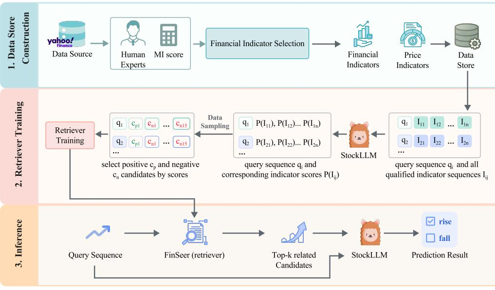
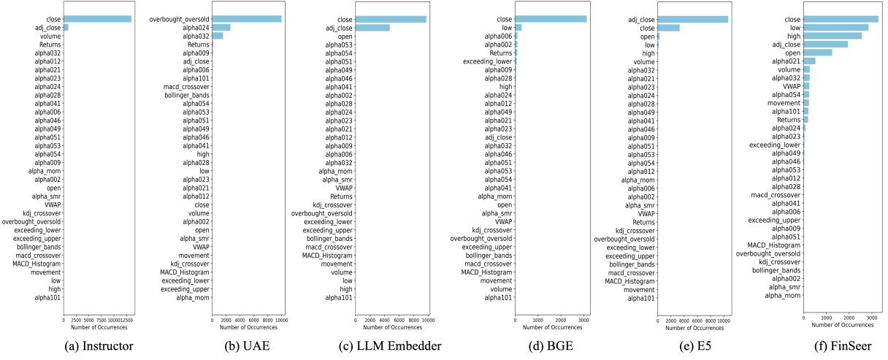
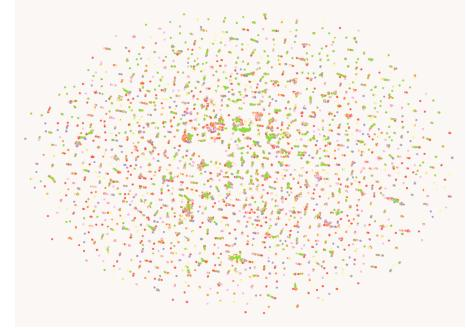
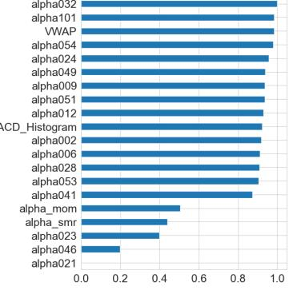

# Enhancing Financial Time-Series Forecasting with Retrieval-Augmented Large Language Models

Mengxi Xiao School of Computer Science, Wuhan University Wuhan, China

Zhengyu Chen School of Computer Science, Wuhan University Wuhan, China

Yuecheng Jiang Stevens Institute of Technology United States

Min Peng School of Computer Science, Wuhan University China

Zihao Jiang School of Computer Science, Wuhan University Wuhan, China

> Yueru He Columbia University United States

Dong Li School of Computer Science, Wuhan University China

> Jimin Huang The Fin AI United States

Qianqian Xie∗ School of Computer Science, Wuhan University China xieq@whu.edu.cn

Lingfei Qian The Fin AI United States

Yijing Xu Columbia University United States

Ruey-Ling Weng Yale University United States

Sophia Ananiadou University of Manchester United Kingdom

## Abstract

Stock movement prediction, a critical task in financial time-series forecasting, relies on identifying and retrieving key influencing factors from vast and complex datasets. However, traditional texttrained or numeric similarity-based retrieval methods often struggle to handle the intricacies of financial data. To address this, we propose the first retrieval-augmented generation (RAG) framework specifically designed for financial time-series forecasting. Our framework incorporates three key innovations: a fine-tuned 1B large language model (StockLLM) as its backbone, a novel candidate selection method enhanced by LLM feedback, and a training objective that maximizes the similarity between queries and historically significant sequences. These advancements enable our retriever, Fin-Seer, to uncover meaningful patterns while effectively minimizing noise in complex financial datasets. To support robust evaluation, we also construct new datasets that integrate financial indicators and historical stock prices. Experimental results demonstrate that our RAG framework outperforms both the baseline StockLLM and random retrieval methods, showcasing its effectiveness. FinSeer, as the retriever, achieves an 8% higher accuracy on the BIGDATA22 benchmark and retrieves more impactful sequences compared to existing retrieval methods. This work highlights the importance of tailored retrieval models in financial forecasting and provides a novel, scalable framework for future research in the field.

## CCS Concepts

• Information systems → Top-k retrieval in databases; Similarity measures; Novelty in information retrieval.

### Keywords

Retrieval-augmented generation, Financial Time-series forecasting, Stock Movement Prediction, Large Language Model

### 1 Introduction

Financial time-series forecasting plays a pivotal role in ensuring market stability and efficiency, directly impacting critical areas such as investment strategies, risk management, and the formulation of economic policies [\[4\]](#page-8-0). One of the most prominent tasks in this domain is stock movement prediction [\[29,](#page-9-0) [30,](#page-9-1) [32\]](#page-9-2), which focuses on forecasting the direction of price changes, i.e. whether a stock will rise or fall. Accurate predictions of financial metrics, including stock movements, interest rates, and economic indicators, are essential for a wide range of stakeholders, from individual investors to large financial institutions. However, the inherent complexity and volatility of financial markets pose significant challenges to forecasting, necessitating the use of advanced methodologies to effectively analyze vast and often noisy datasets.

<sup>∗</sup>Corresponding author.

Traditional stock movement prediction methods [\[6,](#page-8-1) [18\]](#page-8-2) relied on analyzing sequences of stock prices and financial indicators[1](#page-1-0) to identify patterns, but they often failed to capture the semantic connections between these sequences, a task at which large language models (LLMs) excel [\[9\]](#page-8-3). However, LLM-based methods [\[29–](#page-9-0)[31\]](#page-9-3) have primarily shifted focus to leveraging textual data such as news and tweets, often using only the past several days' closing prices as reference while overlooking the rich insights embedded in historical time-series data [\[1\]](#page-8-4). This highlights the need to effectively integrate financial time-series data with LLMs. Directly working with such data presents a challenge due to its vast scale, encompassing both the breadth of influencing variables and the depth of historical trends. To address this, a retrieval-based approach is necessary to efficiently sift through extensive time-series data, extracting meaningful information to enhance LLMs' ability to deliver more accurate and robust stock movement predictions.

Although retrieval-augmented generation (RAG) methods have been applied for various tasks [\[2,](#page-8-5) [8,](#page-8-6) [13\]](#page-8-7), it is challenging to directly apply them to financial time-series retrieval. First, most embeddingbased retrieval methods (retrievers) [\[14,](#page-8-8) [22,](#page-8-9) [24,](#page-9-4) [28,](#page-9-5) [39\]](#page-9-6) are trained on textual data and struggle to process numeric time-series data, which lacks explicit semantic information. Second, distance-based retrieval methods like Dynamic Time Warping (DTW) [\[35\]](#page-9-7) focus on numeric similarities and fail to capture deeper semantic relationships or contextual nuances essential for stock movement prediction. These limitations underscore the need for a more tailored retrieval framework designed for financial time-series data.

To address these challenges, we introduce a retrieval-augmented framework for stock movement prediction, featuring the first dedicated retriever for financial time-series forecasting, Financial Time-Series Retriever (FinSeer). Unlike previous RAG methods, which rely on pre-trained encoders or distance-based metrics, our framework is the first to train a dedicated retriever tailored for continuous and complex temporal sequences. The whole retrieval framework is shown in Figure [1.](#page-2-0)

To address the limitations of existing datasets, which often contain only price data, and to better align with professional financial analysis, we construct new datasets by integrating 20 groups of financial indicators. These indicators provide critical insights into market behavior that stock prices alone cannot capture[2](#page-1-1) . We begin by selecting high-trade-volume U.S. stocks, and the indicators are chosen through domain expert consultation and mutual information analysis. These indicators are then serialized and divided into train, valid and test sets. By training the retriever on datasets enriched with diverse financial indicators, our retrieval framework incorporates financial domain expertise, enabling it to interpret the implications of trending signals that uncover deeper patterns beyond surface-level trend similarities. The testing set, designed to mimic real-world economic analysis, ensures a robust evaluation of model performance in practical financial scenarios.

To train our retriever to identify semantically related sequences and align the retriever's priorities with those of the LLM, we introduce a novel retrieval mechanism with three key innovations: a new backbone LLM, a novel method for selecting positive and negative candidates, and a new training objective. First, to activate the LLM's inherent knowledge and ensure instruction-following capabilities, we fine-tune a 1B parameter LLM (LLaMA3.2-1B Instruct) [\[7\]](#page-8-11), creating StockLLM as the backbone model of our retriever. By using a smaller LLM, we establish a more challenging experimental setup, ensuring performance improvements are attributable to FinSeer rather than the LLM's capacity. Next, StockLLM identifies timeseries segments that enhance the generative process, feedbacks from StockLLM are used to select the most beneficial sequences that could lead the model to make the correct decision as positive candidates and the least beneficial as negative candidates. This could bridge the gap between the retriever and the LLM and ensure that retrieved data aligns with the LLM's forecasting priorities. Finally, the training objective, inspired by Zhang et al. [\[39\]](#page-9-6), ensures the retriever distinguishing historically significant sequences (positive candidates) from noisy sequences (negative candidates) by maximizing the similarity between the query and candidate sequences. This prioritizes meaningful patterns while minimizing irrelevant data, outperforming traditional methods that struggle to separate signal from noise in complex financial time series.

Based on FinSeer, the inference process of our RAG framework consists of three steps: (1) using FinSeer to retrieve relevant sequences from the candidate pool, (2) incorporating these sequences into StockLLM's input context, and (3) combining this enriched context with the original query to perform forecasting. This approach effectively integrates salient historical patterns with current data, improving prediction accuracy.

To thoroughly evaluate the performance of our RAG framework and the retriever, we rely solely on temporal information, excluding additional textual data like news. For the RAG framework evaluation, StockLLM serves as the backbone model, integrated with different retrieval methods for comparison. Experimental results demonstrate that using our RAG framework outperforms bare StockLLM, indicating that the RAG framework enhances LLM performance by incorporating relevant time-series data as financial context. However, RAG with retrieval models trained on text data does not always improve performance compared to bare StockLLM. In some cases, performance even declines. This suggests that these retrieval models cannot effectively identify beneficial time-series data that could enhance the model's predictions, which highlights a fundamental gap between text-based retrieval and time-series data. Furthermore, RAG framework with FinSeer consistently surpasses all other retrieval models, such as Instructor [\[22\]](#page-8-9), BGE (BAAI General Embedding) [\[28\]](#page-9-5), LLM-Embedder [\[39\]](#page-9-6), UAE [\[14\]](#page-8-8), and E5 mistral-7b-instruct [\[24\]](#page-9-4), demonstrating the effectiveness of our trained FinSeer in identifying relevant time-series financial data to enhance stock movement prediction. Further analysis of retrieval results reveals that FinSeer uniquely identifies relevant financial indicators that enhance LLM performance, while other retrievers predominantly select sequences based on superficial similarities, such as close price and adjusted close price. This behavior underscores a critical limitation of text-trained models: they focus on surface-level patterns and fail to discern truly valuable time-series

<span id="page-1-0"></span><sup>1</sup> Financial indicators [\[10\]](#page-8-10) are professional market analysis metrics derived from price data, where their values or crossover points signal fluctuations in the stock market, indicating rising or falling trends. However, relying on one or two indicators can introduce bias, and if an indicator only provides meaningful information at crossover points, it may fail to offer valuable insights during periods without crossings.

<span id="page-1-1"></span><sup>2</sup> For instance, the overbought area in the KDJ indicator group [\[26\]](#page-9-8), where > 80, > 70, and > 90, signals a potential falling trend.

<span id="page-2-0"></span>

Figure 1: Overview of our time-series RAG framework.

information. In contrast, FinSeer effectively bridges this gap, demonstrating its ability to uncover underlying relevance in financial data. Our contributions are summarized as follows:

- (1) We propose the first RAG framework for financial time-series forecasting, in which the retrieval mechanism features three key innovations: a fine-tuned 1B parameter LLM (StockLLM) as the backbone, a novel candidate selection method leveraging LLM feedback to identify beneficial sequences, and a training objective that maximizes similarity between queries and historically significant sequences, enabling the retriever to uncover meaningful patterns while minimizing noise in complex financial data.
- (2) We construct new training and testing datasets to address the limitations of existing ones containing only price data, and better align with real-world economic analysis. Besides price data, these datasets integrate financial indicators that signal upward or downward trends, carefully selected through domain expert consultation and mutual information analysis. By using new training datasets, we train the retriever to uncover deeper patterns beyond surface-level trends during training. While the testing set, designed to mimic real-world scenarios, ensures robust evaluation of model performance in practical financial applications.
- (3) We propose a new retriever, FinSeer, specifically designed for time-series forecasting, trained on newly constructed datasets that integrate financial indicators alongside historical stock prices. By leveraging LLM feedback and prioritizing historically significant sequences, FinSeer uncovers deeper patterns beyond surface-level trends, setting it apart from traditional methods.

- (4) Experimental results demonstrate that our RAG framework outperforms bare StockLLM and random retrieval, highlighting its effectiveness, while our retriever, FinSeer, surpasses existing RAG methods in stock movement prediction across three datasets, achieving an 8% higher accuracy on BIGDATA22 compared to a general-purpose LLM-feedbackbased retriever. Furthermore, FinSeer retrieves more dynamic and impactful sequences, showcasing its ability to identify and leverage the most relevant patterns for forecasting.
### 2 Problem Definition and Goals

Retrieval-augmented financial time-series forecasting [\[19\]](#page-8-12) involves predicting future values or trends () based on a given query sequence () and a set of retrieved historical sequences (). These sequences are collected over time at regular intervals. In the retrieval process, the goal of the retrieval model () is to efficiently identify and extract the most useful historical sequences from a large pool of candidates. By providing relevant context, the retrieval model enhances the forecasting model's ability to make accurate and reliable predictions.

Stock Movement Prediction Task. In the specific task of stock movement prediction [\[34\]](#page-9-9), the problem is framed as a binary classification task: predicting whether a stock's price will rise or fall on the next trading day. Given a query sequence , which represents the stock's price over the previous days, the model retrieves relevant sequences as context and predicts the stock's movement , for the next trading day . Table [1](#page-3-0) defines the major symbols used in this paper.

Rise/Fall Threshold Settings. To classify daily movements as rise or fall, we first calculate returns , which represents the percentage

Table 1: The definition of symbols.

<span id="page-3-0"></span>

| General Time-series<br>Symbol | Stock Movement<br>Prediction Symbol | Definitions                                                                                                                                                                                                                             |
|-------------------------------|-------------------------------------|-----------------------------------------------------------------------------------------------------------------------------------------------------------------------------------------------------------------------------------------|
| 𝑞                             | 𝑞<br>, , 𝑞𝑑−1}<br>= {𝑞𝑑−𝑡           | The query time-series data. In stock movement prediction, 𝑞 refers to the query stock price<br>sequence of length 𝑡, containing stock price data from trading day 𝑑 − 𝑡 to trading day 𝑑 − 1.                                           |
| 𝐺(𝑞)                          | 𝐺(𝑞, 𝑑) ∈ {rise,<br>fall}           | The final output 𝐺 given the query 𝑞. In stock movement prediction, 𝐺(𝑞, 𝑑)<br>shows the genera<br>tion 𝐺 of the query stock 𝑞 on the query trading day 𝑑, belonging to rise or fall.                                                   |
| 𝑃 (𝑐) = 𝐿𝐿𝑀(𝑂 𝑞, 𝑐)           | 𝑞, 𝑐)<br>𝑃 (𝑐) = 𝐿𝐿𝑀(𝑀𝑑             | The probability 𝑃 of the LLM to generate an accurate output 𝑂 given the query sequence 𝑞 and<br>a candidate sequence 𝑐. In stock movement prediction, 𝑃 (𝑐) refers to generating the accurate<br>movement 𝑀 on the query trading day 𝑑. |
| 𝑖 = 1, , 𝑘}<br>CP = {𝑐𝑖       |                                     | The set of top-k retrieved sequences as positive examples, where 𝑃 (𝑐𝑖) ≥ 𝑃 (𝑐𝑖+1).                                                                                                                                                     |
| 𝑖 = 𝑘 + 1, , 𝑛}<br>CN = {𝑐𝑖   |                                     | The set of negative retrieved sequences, where 𝑃 (𝑐𝑖) ≥ 𝑃 (𝑐𝑖+1).                                                                                                                                                                       |
| 𝑤𝑖                            |                                     | = 𝑃 (𝑐𝑖),𝑖 = 1, , 𝑘.<br>𝑡ℎ retrieved sequences, where 𝑤𝑖<br>The soft weight of the 𝑖                                                                                                                                                    |
| 𝑅                             |                                     | The retrieve model.                                                                                                                                                                                                                     |

change in the closing price over consecutive days.

$$R_l = \frac{\text{adj\_close}_d - \text{adj\_close}_{d-1}}{\text{adj\_close}_{d-1}} \, \ast \, 100 \tag{1}$$

Following Yoo et al. [\[37\]](#page-9-10) and Soun et al. [\[21\]](#page-8-13), we classify the movement as rise if return exceeds 0.55, fall if it is below -0.5. In line with previous experimental settings [\[29,](#page-9-0) [31\]](#page-9-3), we do not evaluate freeze cases. However, we include sequences with ∈ [−0.5, 0.55] as freeze candidates in the candidate pool, ensuring a diverse and comprehensive set of historical data for context.

$$M_{q,d} = \begin{cases} \text{rise}, & R_t > 0.55\\ \text{fall}, & R_t < -0.5\\ \text{freeize}, & -0.5 \le R_t \le 0.55 \end{cases} \tag{2}$$

Rationale for Unbalanced Thresholds. The asymmetrical thresholds for classifying daily movements (0.55 for rises and -0.5 for falls) reflect the inherent dynamics of stock market behavior. Stock prices typically rise gradually due to sustained investor optimism but fall sharply during panic selling or profit-taking. The stricter rise threshold prevents minor upward fluctuations from being misclassified as significant increases, while the more lenient fall threshold ensures meaningful downward trends are captured. This approach aligns with market realities, improving the reliability of movement classifications.

### 3 The RAG Framework

To identify valuable sequences from vast amounts of stock data and conduct stock movement prediction, we propose a novel RAG framework with new datasets and a novel retrieval mechanism with a new backbone LLM. First, we construct three datasets that integrate financial indicators alongside historical stock prices, addressing the limitations of existing datasets and better aligning with real-world economic analysis. Second, we introduce StockLLM, a fine-tuned 1B parameter LLM, as the backbone to ensure instruction-following capabilities and establish a challenging experimental setup. Finally, we design a novel retrieval mechanism that leverages LLM feedback to select positive and negative candidates and employs a new training objective to prioritize historically significant sequences. This comprehensive framework bridges the gap between retrieval models and LLMs, enhancing the time-series forecasting process.

### 3.1 Dataset Construction

To address the limitations of existing datasets and better align with real-world economic analysis, we construct new datasets by integrating financial indicators alongside historical stock prices, enabling deeper insights into market behavior that stock prices alone cannot capture. This section details stock selection, raw data collection (Collection of Basic Price Indicators) and financial indicator selection process(Calculation and Selection of Financial Indicators). Specifically, our datasets are built using high-trade-volume U.S. stocks, while the indicators are selected through domain expert consultation and mutual information analysis.

Stock Selection. To construct our datasets, we select high-tradevolume U.S. stocks across three periods: 2014-2015, 2017-2018, and 2022-2023. The first two periods align with two benchmark datasets: for 2014-2015, we use the same stocks as the ACL18 dataset [\[34\]](#page-9-9), and for 2017-2018, we use the same stocks as the BIGDATA22 dataset [\[21\]](#page-8-13). To incorporate more recent data, we manually select high-trade-volume stocks from 2022-2023 to create the STOCK23 dataset. This ensures our training and evaluation reflect recent market conditions and provide a robust benchmark for stock movement prediction.

Collection of Basic Price Indicators. Stock data is collected using the Yahoo Finance API [\[33\]](#page-9-11), which provides basic price indicators such as the opening price, highest price, lowest price, adjusted closing price, and trading volume for each trading day. The daily price movement is then calculated as the reference answer for model training and evaluation.

We then divide the stock data into training, validation, and test sets. To ensure temporal integrity and prevent information leakage, we partition the dataset by stocks rather than by time. This approach maintains consistent time ranges across splits while ensuring that stocks in the validation and test sets are entirely unseen during training. Unlike time-based splits, stock-based partitioning provides a more robust evaluation of the model's ability to generalize to new stocks, better reflecting real-world scenarios where models are applied to unseen entities. Table [2](#page-4-0) summarizes the stock counts for each split in our datasets.

Calculation and Selection of Financial Indicators. In our datasets, we integrate financial indicators to provide critical insights into market behavior that stock prices alone cannot capture. Following analyzing methods in the book Machine learning for trading [\[10\]](#page-8-10), we

<span id="page-4-0"></span>Enhancing Financial Time-Series Forecasting with Retrieval-Augmented Large Language Models Conference'17, July 2017, Washington, DC, USA

Table 2: Dataset statistics.

| Dataset        | Stock amount |       |      | Trading dates         |                       |  |  |
|----------------|--------------|-------|------|-----------------------|-----------------------|--|--|
|                | train        | valid | test | all sequences         | query sequences       |  |  |
| ACL18 [34]     | 33           | 5     | 33   | 2014.06.02-2015.12.31 | 2015.06.03-2015.12.31 |  |  |
| BIGDATA22 [21] | 22           | 3     | 22   | 2019.04.01-2020.12.31 | 2020.04.09-2020.12.31 |  |  |
| STOCK23        | 24           | 3     | 24   | 2022.01.03-2023.12.31 | 2023.01.03-2023.12.31 |  |  |

conduct an analysis using query sequences in all training sets to explore the relationship between commonly used financial indicators and returns. To measure the relationship between these indicators and returns, we utilize Mutual Information (MI), a non-linear measure of dependency that quantifies the amount of information one variable contains about another. Specifically, the MI between an indicator and returns is calculated as:

$$I(X; R_t) = \int_{\mathcal{X}} \int_r p(\mathbf{x}, r) \log \left( \frac{p(\mathbf{x}, r)}{p(\mathbf{x}) p(r)} \right) \, d\mathbf{x} \, dr,\tag{3}$$

where (, ) represents joint probability density function of (indicator) and (returns), () shows marginal probability density function of , and () is marginal probability density function of .

We compute MI scores for each indicator and select the top-20 indicator groups with the highest scores as our candidates, with the detailed score ranking provided in Appendix [B.1.](#page-9-12) Additionally, an example of a data piece from our datastore is illustrated in Appendix [A.1.](#page-9-13)

### 3.2 Sequence Serialization

Since stock movement prediction depends on the changes in related features rather than their exact values, we serialize stock prices and financial indicators into a time-series format. We use JSON to represent these sequences, as it has been demonstrated to effectively support LLMs in interpreting time-series data [\[5,](#page-8-14) [20,](#page-8-15) [36\]](#page-9-14).

Query Sequence Serialization We select query sequences where the query date is at least one year after the start date of the corresponding split in the dataset. This ensures that each query has enough candidate sequences for retrieval. For example, in the ACL18 dataset, which spans from 2014-06-02 to 2015-12-31, the query sequences are defined as those from 2015-06-03 to 2015-12-31.

Each query sequence contains the adjusted close price from the previous five trading days along with basic stock information. The indicator is represented as a five-day sequence, with a one-day sliding window applied across trading days. For example, when inquerying about stock MO on 2015-06-02, the query sequences contains stock name, query date, last five trading dates and their corresponding adjusted close prices. The serialized sequence is shown below:

```
{ " query_stock ": "MO",
```

```
" query_date ": " 2015 -06 -02 ",
" recent_date_list ": [" 2015 -05 -26 ", " 2015 -05 -27 ", " 2015 -05 -28 ", " 2015 -05 -29 ", "
        2015 -06 -01 "] ,
" adjusted_close_list ": [29.669 , 29.9872 , 29.8657 , 29.6227 , 29.6227]}
```
Candidate Sequence Serialization As new information becomes available, the candidate pool dynamically incorporates sequences from the most recent trading days. For instance, when the query date is 2015-06-03, the candidate pool includes sequences from 2014- 06-02 to 2015-06-02. When the query date advances to 2015-06-04, the sequence for 2015-06-03 is added to the candidate pool without

the need for additional training. This demonstrates the scalability of our method.

For each candidate stock on a specific date, we select 6 basic price indicators and 20 groups of financial indicators. Each candidate sequence includes a typical financial indicator along with basic stock information. As the same as query serialization, the indicator is represented as a five-day sequence, with a one-day sliding window applied across trading days. For example, a candidate represent stock MO on date 2014-07-02, with highest price as its indicator. The sequence includes basic information containing stock name, date, movement, last five trading dates and their corresponding highest prices. The serialized sequence is shown below:

```
{ " candidate_stock ": "MO",
  " candidate_date ": " 2014 -07 -02 ",
  " candidate_movement ": " freeze ",
  " recent_date_list ": [" 2014 -06 -25 ", " 2014 -06 -26 ", " 2014 -06 -27 ", " 2014 -06 -30 ", "
          2014 -07 -01 "] ,
  " high_list ": [42.2 , 42.0 , 41.86 , 42.28 , 42.0]}
```
### 3.3 Retriever Training

To identify valuable information from vast amounts of sequences and uncover semantic relationships between them, we introduce a novel retrieval mechanism featuring three key innovations: a finetuned 1B parameter LLM (StockLLM) as the backbone, a candidate selection method leveraging LLM feedback to identify beneficial sequences and a training objective that maximizes similarity between queries and historically significant sequences, enabling the trained retriever to uncover meaningful patterns while minimizing noise in complex financial data. While inspired by [\[39\]](#page-9-6), our approach is uniquely tailored to financial time-series data, addressing the challenges of relevance assessment and alignment in a domain where traditional retrieval methods often fall short. This section details the training process of our framework, including the training of the LLM backbone, candidate scoring and selection, and the training of the retriever, which contains the training objective and knowledge distillation.

The LLM Backbone. To activate the LLM's inherent knowledge and ensure instruction-following capabilities, we fine-tune a 1B parameter LLM (LLaMA 3.2-1B-Instruct) [\[7\]](#page-8-11) using the LoRA technique for efficient low-rank adaptation, resulting in StockLLM. By intentionally using a smaller backbone model, we establish a more challenging experimental setup, ensuring that performance improvements are attributable to FinSeer's retrieval capabilities rather than the LLM's capacity. The fine-tuning process is implemented using the LlamaFactory framework [\[40\]](#page-9-15), with the following configuration: a learning rate of 5e-5, a cosine scheduler, gradient accumulation over 8 steps, mixed-precision (fp16) training, and 5 epochs of training with regular evaluation to log metrics and select the best-performing checkpoint. This setup demonstrates the robustness of our framework in extracting meaningful insights even under constrained model size, highlighting the effectiveness of FinSeer in enhancing financial forecasting tasks.

Candidate Scoring. To determine whether a candidate sequence assists in predicting the movement of the query, we use LLM feedback to score each candidate. Specifically, for a given query , we integrate the query sequence and each candidate sequence from the candidate pool as concurrent inputs to the LLM. The LLM outputs logits, which are unnormalized scores representing the model's

confidence for each possible class (e.g., "rise" or "fall"). These logits are transformed into probabilities () using the softmax function:

$$P(c) = \frac{e^{z_c}}{\sum_f e^{z_f}},\tag{4}$$

where is the logit for the correct class (e.g., "rise" if the true movement is upward) and represents the logits for all possible classes. The resulting probability () serves as the score for the candidate with respect to the query .

Candidate Selection. We rank the candidate sequences in descending order based on their scores (). The top-1 sequence is selected as a positive candidate, while the bottom 15 sequences are chosen as negative candidates. The sets of selected positive and negative sequences are denoted as CP and CN, respectively.

Training Objective. Our retriever () is designed to intelligently distinguish between historically significant sequences CP and noisy sequences CN. The training objective is to ensure that () prioritizes sequences from CP while minimizing attention to those from CN. This is achieved by maximizing a similarity measure (, ) between the query sequence and candidate sequences . Mathematically, the retriever's objective is formulated as:

$$R(q) = \arg\max_{\mathbf{s} \in \mathbb{C}_{\mathbb{P}} \cup \mathbb{C}_{\mathbb{N}}} \sup(q, \mathbf{s}).\tag{5}$$

By focusing on sequences that maximize (, ), the retriever ensures that the most informative and contextually relevant historical sequences are identified.

Knowledge Distillation. To leverage the scoring derived from the LLM, we employ knowledge distillation, which transfers knowledge from the teacher model (LLM) to the student model (retriever) by mimicking the teacher's output distribution. This approach effectively captures nuanced patterns and predictions from the LLM. Specifically, we minimize the Kullback-Leibler (KL) divergence between the candidate distributions computed using the LLM's rewards and those predicted by the embedding model. For each query and its candidate list {CP, CN}, we derive the LLM's rewards for the candidates, denoted as { (), = 1, ..., }. To make these rewards suitable for distillation, we normalize them using a softmax function with temperature :

$$\mathbf{w}_{l} = \text{softmax}_{R} \left( \frac{P(c_{l})}{\alpha} \right). \tag{6}$$

The KL divergence is then computed as follows:

$$\min \sum_{c} -\omega_{i} \times \log \left( \frac{\exp \left( \left< \mathbf{e}_{q}, \mathbf{e}_{c_{i}} \right> / \tau \right)}{\sum_{c' \in \mathbb{C}} \exp \left( \left< \mathbf{e}_{q}, \mathbf{e}_{c'} \right> / \tau \right)} \right), \tag{7}$$

where and are the embeddings of the query and candidate , respectively, and is a temperature parameter. This loss function optimizes the similarity between the query embedding and the embeddings of the top-ranked candidates, enhancing the retriever's ability to accurately predict stock price movements.

### 3.4 Inference

The inference process of our RAG framework, built on FinSeer, consists of three key steps to enhance stock movement prediction. First, FinSeer retrieves relevant sequences from the candidate pool, leveraging its ability to identify historically significant patterns. Second, these retrieved sequences are incorporated into StockLLM's input

context, enriching the model's understanding of temporal dynamics. Finally, the enriched context is combined with the original query to generate forecasts. By integrating salient historical patterns with current data, this approach bridges the gap between past trends and present conditions, significantly improving prediction accuracy and robustness in real-world financial scenarios.

### 4 Experiment

### 4.1 Experimental Settings

Datasets. We evaluate the effectiveness of our RAG framework on the test sets of the three datasets described in Table [2,](#page-4-0) with ACL18 containing 2,876 query sequences, BIGDATA22 containing 2,868 queries, and STOCK23 containing 4,128 queries. These thousand-scale queries help mitigate random bias, ensuring a robust and reliable evaluation of model performance. To ensure a comprehensive evaluation, for each query sequence, we include all sequences containing financial indicators across all stocks in the test set (not limited to the same stock), with data available up to the query date, as potential candidates. No additional restrictions are imposed, enabling a robust assessment of the models' performance in real-world financial forecasting scenarios.

Baselines. To evaluate the efficiency of our RAG framework, we choose bare StockLLM and random retrieval as our baselines. To evaluate our retriever FinSeer, we select five competitive RAG models from the top of the MTEB English Leaderboard as baselines: (1) Instructor-large [\[22\]](#page-8-9): A 335M instruction-finetuned text embedder that encodes sequences into 768-dimensional tensors. (2) UAE-largev1 [\[14\]](#page-8-8): A 335M ANGLE-optimized text embedding model that encodes sequences into 1024-dimensional tensors. (3) BGE-largeen-v1.5 [\[28\]](#page-9-5): A 335M general embedder pre-trained with Retro-MAE [\[27\]](#page-9-16), encoding sequences into 1024-dimensional tensors. (4) LLM-Embedder [\[39\]](#page-9-6): A 109M embedder fine-tuned from BGE-largeen-v1.5, designed as a unified embedding model to support diverse retrieval augmentation needs for LLMs. It encodes sequences into 768-dimensional tensors. (5) E5-mistral-7b-instruct [\[24\]](#page-9-4): A 7111M embedder initialized from Mistral-7B-v0.1 [\[11\]](#page-8-16) and fine-tuned on multilingual datasets, encoding sequences into 4096-di-mensional tensors.

Evaluation Metrics. We employ Accuracy (ACC) and Matthews Correlation Coefficient (MCC) [\[17\]](#page-8-17) to assess the performance of FinSeer and the baseline models on the stock movement prediction task. These metrics evaluate the performance of stock movement prediction based on the distribution of positive and negative samples.

### 4.2 Main Results

Table [3](#page-6-0) summarizes the performance of stock movement prediction across the three datasets.

We analyze our framework and retriever separately to evaluate their contributions. First, our RAG framework outperforms both bare StockLLM and random retrieval across all datasets, demonstrating its effectiveness in enhancing stock movement prediction. Second, among all evaluated retrieval methods, FinSeer consistently achieves the best performance when integrated with StockLLM, showcasing its ability to retrieve valuable sequences that improve forecasting accuracy. Notably, FinSeer is the only retriever that

<span id="page-6-0"></span>Table 3: Results of stock movement predictions using LLMs and retrieval models. The asterisk (*) indicates the LLM employed while using retrieval models.

| Retrieving Methods |       | ACL18  | BIGDATA22 |        | STOCK23 |        |
|--------------------|-------|--------|-----------|--------|---------|--------|
| (+ StockLLM)       | ACC   | MCC    | ACC       | MCC    | ACC     | MCC    |
| w/o Retrieval      | 0.496 | -0.007 | 0.497     | -0.008 | 0.509   | 0.021  |
| Random Retrieve    | 0.481 | -0.036 | 0.521     | 0.045  | 0.496   | -0.004 |
| DTW                | 0.518 | 0.045  | 0.505     | 0.021  | 0.492   | -0.007 |
| Instructor         | 0.496 | -0.008 | 0.497     | -0.006 | 0.505   | 0.010  |
| UAE                | 0.482 | -0.036 | 0.495     | -0.008 | 0.494   | -0.009 |
| E5                 | 0.510 | 0.028  | 0.503     | 0.008  | 0.499   | -0.001 |
| BGE                | 0.489 | -0.019 | 0.487     | -0.026 | 0.488   | -0.014 |
| LLM Embedder       | 0.499 | 0.000  | 0.459     | -0.083 | 0.503   | 0.007  |
| FinSeer            | 0.521 | 0.042  | 0.538     | 0.079  | 0.542   | 0.085  |

achieves stable improvements over bare StockLLM on all datasets, while other methods exhibit inconsistent results, sometimes enhancing predictions and other times degrading them. Furthermore, our experiments reveal that incorporating a retrieval process does not always guarantee performance improvements, as retrieval errors can mislead the LLM and harm predictions. This underscores the critical need for retrieval models that align closely with the LLM's objectives, a challenge that FinSeer effectively addresses through its tailored design.

The minimal performance difference between the instructionfinetuned retriever (Instructor) and the no-retrieval baselines highlights the inherent challenge of time-series retrieval. Unlike text retrieval, time-series retrieval does not solely rely on task understanding, as candidate sequences often appear similar, making it difficult to distinguish valuable ones. The angle-optimized retriever (UAE) shows inconsistent performance across datasets, as its ability to differentiate similarity between query and candidate sequences does not fully align with the LLM's perception of importance. Similarly, LLM Embedder, our backbone model trained with LLM feedback, struggles to generalize to time-series retrieval tasks, further underscoring the complexity of the problem.

The best-performing baseline is E5, which achieves competitive results despite its significantly larger model size and embedding dimensions (five times larger than FinSeer). However, FinSeer outperforms E5 on all datasets. This demonstrates that FinSeer successfully learns the preferences of LLMs and effectively enhances their time-series forecasting ability through retrieval, even under challenging conditions.

In summary, while RAG methods do not guarantee performance improvements due to the risk of retrieval errors, FinSeer stands out by consistently retrieving high-quality sequences that align with the LLM's forecasting objectives, leading to superior results compared to other retrievers.

### 4.3 Ablation Study

Indicator Occurrences In this part, we analyze what indicators all RAG models retrieve. We calculate indicator occurrences on ACL18 dataset and the results are shown in Figure [2.](#page-7-0)

As shown in the figure, FinSeer is the only model that successfully extracts a diverse and comprehensive set of indicators while

achieving superior performance. This clearly demonstrates its advanced temporal retrieval capabilities. Specifically, while other models like LLM Embedder and Instructor predominantly focus on basic indicators such as close price and adjusted close price, FinSeer effectively identifies and retrieves a wide range of technical indicators, including kdj crossover, MACD Histogram, Bollinger Bands, and various alpha factors. This richer set of retrieved indicators provides FinSeer with more comprehensive auxiliary information, enabling more accurate and reliable predictions.

Candidate Movement Correlation In this section, we investigate whether the LLM relies on the movement trends of retrieved sequences to make predictions. To this end, we compute the correlation between the movements of retrieved sequences and the LLM's generated results. The detailed calculation process is provided in Appendix [B.2.](#page-9-17)

The results in Table [4](#page-6-1) reveal no significant correlation between the movement direction (rise or fall) of the retrieved candidate sequences and the final predictions of StockLLM. This finding indicates that StockLLM does not simply mirror the movement trends of the retrieved sequences but instead analyzes their specific content to infer the query's movement direction. This ability highlights the LLM's capacity to extract meaningful insights from complex time-series data.

### <span id="page-6-1"></span>Table 4: Correlation between the movements of retrieved sequences and LLM's generated results.

| Dataset   | RAG Model    | Correlation | P-Value |
|-----------|--------------|-------------|---------|
|           | Instructor   | -0.098      | 0.000   |
|           | UAE          | -0.068      | 0.000   |
|           | E5           | -0.108      | 0.000   |
| ACL18     | BGE          | 0.175       | 0.000   |
|           | LLM Embedder | 0.014       | 0.457   |
|           | FinSeer      | 0.054       | 0.004   |
|           | Instructor   | -0.072      | 0.000   |
|           | UAE          | 0.009       | 0.633   |
|           | E5           | -0.040      | 0.032   |
| BigData22 | BGE          | 0.093       | 0.000   |
|           | LLM Embedder | 0.060       | 0.001   |
|           | FinSeer      | 0.077       | 0.000   |
|           | Instructor   | -0.114      | 0.000   |
|           | UAE          | -0.093      | 0.000   |
|           | E5           | -0.064      | 0.000   |
| STOCK23   | BGE          | 0.131       | 0.000   |
|           | LLM Embedder | 0.015       | 0.350   |
|           | FinSeer      | 0.032       | 0.041   |
|           |              |             |         |

This observation underscores the critical role of retrieval quality in RAG models, as the relevance and informativeness of retrieved sequences directly influence prediction performance. Notably, Stock-LLM is a relatively small 1B parameter LLM, making this a particularly challenging setting. Despite this, our time-series-tailored RAG model, FinSeer, successfully enhances StockLLM's performance by retrieving rich and relevant time-sensitive information. This demonstrates the effectiveness of our approach in improving prediction accuracy and showcases its potential for financial time-series forecasting.

### 4.4 Case Study

This case study illustrates the critical importance of alignment between the retriever and the LLM's forecasting preferences in financial time-series analysis. We examine the stock XOM on 2015-06-25

### <span id="page-7-0"></span>Conference'17, July 2017, Washington, DC, USA Mengxi Xiao et al.



Figure 2: Indicator occurrences of different RAG models on ACL18 dataset.

from the ACL18 dataset, where the adjusted close price exhibited a pronounced downward trend. The query sequence is as follows:

```
{ " query_stock ": "XOM ",
```

```
" query_date ": " 2015 -06 -25 ",
" recent_date_list ": [" 2015 -06 -18 ", " 2015 -06 -19 ", " 2015 -06 -22 ", " 2015 -06 -23 ", "
        2015 -06 -24 "] ,
```
" adjusted_close_list ": [58.0813 , 57.8979 , 57.8707 , 57.8027 , 57.5377]} While multiple retrievers were evaluated, only FinSeer success-

fully enabled StockLLM to predict the correct movement as a fall. Specifically, FinSeer retrieved five diverse indicators—close price, adjusted close price, alpha021, alpha054, and the highest price—providing a comprehensive view of the stock's behavior. Alpha021 identifies trends based on short- and long-term price averages and volume conditions, while alpha054 combines price and volume rankings to assess performance within a specific time window. These indicators allowed StockLLM to accurately assess whether the downward trend would persist or reverse, demonstrating the value of retrieving contextually relevant and diverse features.

In contrast, other retrievers, such as Instructor, BGE, LLM Embedder, and E5, extracted sequences dominated by close or adjusted close prices, all reflecting similar downward trends. While these sequences aligned with the current trend, they failed to provide actionable insights for forecasting future movements, leading StockLLM to misinterpret them as noise and incorrectly predict a rise. Similarly, UAE retrieved sequences indicating overbought and oversold conditions, including three rise and two freeze trends. Although overbought signals often suggest a potential downturn, the retrieved sequences themselves exhibited rising or frozen trends, confusing StockLLM and resulting in an erroneous prediction. This case study underscores the superiority of FinSeer in retrieving meaningful and diverse indicators that align with the LLM's forecasting logic, enabling more accurate and reliable predictions.

### 4.5 Indicator Sequence Visualization

To intuitively examine how FinSeer embeds indicator sequences, we use LargeVis [\[23\]](#page-9-18) to reduce the embeddings to two dimensions. In Figure [3,](#page-7-1) we visualize[3](#page-7-2) the vector space of nine indicators, including adjusted close price, open price, high price, low price, close price, volume, movement, returns, and WAP. The results show that the green points, representing movement information, are wellclustered, indicating that FinSeer effectively captures meaningful patterns. However, this also suggests that deeper relationships between stock movements and indicators remain to be explored, highlighting the potential for further research in this area.

<span id="page-7-1"></span>

Figure 3: Visualization of indicator sequence embeddings on ACL18 dataset.

## 5 Related Work

### 5.1 Stock Movement Prediction

Non-LLM Methods. Traditional approaches to stock movement prediction have focused on various aspects of financial data. One prominent category of methods analyzes stock price sequences and their corresponding technical indicators [\[6,](#page-8-1) [18\]](#page-8-2) to identify patterns in historical data for predicting future movements. However, due to the complexity of factors influencing stock prices, subsequent methods have incorporated additional contextual information, such

<span id="page-7-2"></span><sup>3</sup>https://medviz.org/app/

as news articles [\[3,](#page-8-18) [16\]](#page-8-19) or social media posts [\[25,](#page-9-19) [34\]](#page-9-9). Despite efforts, these methods are highly susceptible to noise and struggle to analyze the vast and diverse nature of financial information effectively.

LLM-based Methods. Recent studies have explored using LLMs for financial prediction tasks, either by fine-tuning open-source models or prompting advanced models like GPT-4. However, even stateof-the-art models, including GPT-4, have achieved only randomguessing-level accuracy in stock movement prediction [\[29–](#page-9-0)[31\]](#page-9-3). This highlights the inherent challenges in identifying and analyzing meaningful patterns in a domain as volatile and multifaceted as stock market prediction.

### 5.2 Time-series forecasting with LLMs

Non-retrieval Methods. To enhance the performance of LLMs in time-series forecasting, existing methods have primarily focused on aligning temporal and textual data, either by transforming timeseries into textual formats or by encoding both modalities into a unified vector space. For instance, a study [\[12\]](#page-8-20) reprograms timeseries data into textual representations suitable for LLMs, enhancing prediction accuracy via declarative prompts. Similarly, some other studies [\[15,](#page-8-21) [38\]](#page-9-20) explore cross-modal alignment: the former applies LLMs to financial forecasting by integrating stock prices with news data, while the latter introduces a cross-modality framework to align time-series with text for improved predictive performance. While these advancements improve alignment, existing methods often struggle to process large-scale time-series data comprehensively due to LLM input limitations. As a result, effectively leveraging extensive historical data remains a challenge. This highlights the need for retrieval-augmented methods, a gap our approach directly addresses.

RAG Methods. With the rapid advancement of RAG techniques in various applications of LLMs, recent research has begun exploring RAG for time-series forecasting. For instance, TimeRAG [\[35\]](#page-9-7) integrates RAG into time-series forecasting by combining Dynamic Time Warping (DTW) with LLMs to improve prediction accuracy. However, relying solely on numeric similarity is insufficient for financial time-series forecasting, as it fails to capture deeper semantic relationships. This underscores the need for a more targeted retrieval framework tailored to the complexities of financial data, a challenge our framework effectively addresses.

### 6 Conclusion

In this work, we introduce the first RAG framework for financial time-series forecasting, featuring a novel retrieval mechanism with three key innovations: a fine-tuned 1B parameter LLM (Stock-LLM), a candidate selection method leveraging LLM feedback, and a training objective that maximizes similarity between queries and historically significant sequences. We also construct new datasets integrating financial indicators and historical stock prices, selected through expert consultation and mutual information analysis, to train the retriever and ensure robust evaluation. Our retriever, Fin-Seer, leverages these datasets and LLM feedback to uncover deeper patterns beyond numeric similarities. Experiments demonstrate that our RAG framework outperforms bare StockLLM and random retrieval, while FinSeer surpasses existing retrieval methods, achieving an 8% higher accuracy on BIGDATA22 and retrieving more impactful sequences. This work highlights the importance of tailored retrieval models in financial forecasting and provides a robust framework for future research.

### References

- <span id="page-8-4"></span>[1] Oscar Bustos and Alexandra Pomares-Quimbaya. 2020. Stock market movement forecast: A systematic review. Expert Systems with Applications 156 (2020), 113464.
- <span id="page-8-5"></span>[2] Lingxi Cui, Huan Li, Ke Chen, Lidan Shou, and Gang Chen. 2024. Tabular data augmentation for machine learning: Progress and prospects of embracing generative ai. arXiv preprint arXiv:2407.21523 (2024).
- <span id="page-8-18"></span>[3] Xiao Ding, Yue Zhang, Ting Liu, and Junwen Duan. 2015. Deep learning for event-driven stock prediction. In Twenty-fourth international joint conference on artificial intelligence.
- <span id="page-8-0"></span>[4] Eugene F. Fama and Kenneth R. French. 2000. Forecasting Profitability and Earnings. The Journal of Business 73, 2 (2000), 161–175.
- <span id="page-8-14"></span>[5] Xi Fang, Weijie Xu, Fiona Anting Tan, Jiani Zhang, Ziqing Hu, Yanjun Qi, Scott Nickleach, Diego Socolinsky, Srinivasan Sengamedu, and Christos Faloutsos. 2024. Large Language Models on Tabular Data–A Survey. arXiv preprint arXiv:2402.17944 (2024).
- <span id="page-8-1"></span>[6] Fuli Feng, Huimin Chen, Xiangnan He, Ji Ding, Maosong Sun, and Tat-Seng Chua. 2018. Enhancing stock movement prediction with adversarial training. arXiv preprint arXiv:1810.09936 (2018).
- <span id="page-8-11"></span>[7] Aaron Grattafiori, Abhimanyu Dubey, Abhinav Jauhri, et al. 2024. The Llama 3 Herd of Models. arXiv[:2407.21783](https://arxiv.org/abs/2407.21783) [cs.AI]<https://arxiv.org/abs/2407.21783>
- <span id="page-8-6"></span>[8] Xiaoxin He, Yijun Tian, Yifei Sun, Nitesh V Chawla, Thomas Laurent, Yann LeCun, Xavier Bresson, and Bryan Hooi. 2024. G-retriever: Retrieval-augmented generation for textual graph understanding and question answering. arXiv preprint arXiv:2402.07630 (2024).
- <span id="page-8-3"></span>[9] Jie Huang and Kevin Chen-Chuan Chang. 2022. Towards reasoning in large language models: A survey. arXiv preprint arXiv:2212.10403 (2022).
- <span id="page-8-10"></span>[10] Stefan Jansen. 2020. Machine Learning for Algorithmic Trading: Predictive models to extract signals from market and alternative data for systematic trading strategies with Python. Packt Publishing Ltd.
- <span id="page-8-16"></span>[11] Albert Q Jiang, Alexandre Sablayrolles, Arthur Mensch, Chris Bamford, Devendra Singh Chaplot, Diego de las Casas, Florian Bressand, Gianna Lengyel, Guillaume Lample, Lucile Saulnier, et al. 2023. Mistral 7B. arXiv preprint arXiv:2310.06825 (2023).
- <span id="page-8-20"></span>[12] Ming Jin, Shiyu Wang, Lintao Ma, Zhixuan Chu, James Y Zhang, Xiaoming Shi, Pin-Yu Chen, Yuxuan Liang, Yuan-Fang Li, Shirui Pan, et al. 2023. Time-llm: Time series forecasting by reprogramming large language models. arXiv preprint arXiv:2310.01728 (2023).
- <span id="page-8-7"></span>[13] Pankaj Joshi, Aditya Gupta, Pankaj Kumar, and Manas Sisodia. 2024. Robust multi model rag pipeline for documents containing text, table & images. In 2024 3rd International Conference on Applied Artificial Intelligence and Computing (ICAAIC). IEEE, 993–999.
- <span id="page-8-8"></span>[14] Xianming Li and Jing Li. 2023. AnglE-optimized Text Embeddings. arXiv preprint arXiv:2309.12871 (2023).
- <span id="page-8-21"></span>[15] Chenxi Liu, Qianxiong Xu, Hao Miao, Sun Yang, Lingzheng Zhang, Cheng Long, Ziyue Li, and Rui Zhao. 2024. TimeCMA: Towards LLM-Empowered Time Series Forecasting via Cross-Modality Alignment. arXiv preprint arXiv:2406.01638 (2024).
- <span id="page-8-19"></span>[16] Qikai Liu, Xiang Cheng, Sen Su, and Shuguang Zhu. 2018. Hierarchical complementary attention network for predicting stock price movements with news. In Proceedings of the 27th ACM International Conference on Information and Knowledge Management. 1603–1606.
- <span id="page-8-17"></span>[17] Brian W Matthews. 1975. Comparison of the predicted and observed secondary structure of T4 phage lysozyme. Biochimica et Biophysica Acta (BBA)-Protein Structure 405, 2 (1975), 442–451.
- <span id="page-8-2"></span>[18] Yao Qin, Dongjin Song, Haifeng Chen, Wei Cheng, Guofei Jiang, and Garrison Cottrell. 2017. A dual-stage attention-based recurrent neural network for time series prediction. arXiv preprint arXiv:1704.02971 (2017).
- <span id="page-8-12"></span>[19] Omer Berat Sezer, Mehmet Ugur Gudelek, and Ahmet Murat Ozbayoglu. 2020. Financial time series forecasting with deep learning: A systematic literature review: 2005–2019. Applied soft computing 90 (2020), 106181.
- <span id="page-8-15"></span>[20] Ananya Singha, José Cambronero, Sumit Gulwani, Vu Le, and Chris Parnin. 2023. Tabular representation, noisy operators, and impacts on table structure understanding tasks in LLMs. arXiv preprint arXiv:2310.10358 (2023).
- <span id="page-8-13"></span>[21] Yejun Soun, Jaemin Yoo, Minyong Cho, Jihyeong Jeon, and U Kang. 2022. Accurate Stock Movement Prediction with Self-supervised Learning from Sparse Noisy Tweets. In 2022 IEEE International Conference on Big Data (Big Data). IEEE, 1691– 1700.
- <span id="page-8-9"></span>[22] Hongjin Su, Weijia Shi, Jungo Kasai, Yizhong Wang, Yushi Hu, Mari Ostendorf, Wen-tau Yih, Noah A. Smith, Luke Zettlemoyer, and Tao Yu. 2023. One Embedder, Any Task: Instruction-Finetuned Text Embeddings. In ACL (Findings). Association

for Computational Linguistics, 1102–1121.

- <span id="page-9-18"></span>[23] Jian Tang, Jingzhou Liu, Ming Zhang, and Qiaozhu Mei. 2016. Visualizing largescale and high-dimensional data. In Proceedings of the 25th international conference on world wide web. 287–297.
- <span id="page-9-4"></span>[24] Liang Wang, Nan Yang, Xiaolong Huang, Linjun Yang, Rangan Majumder, and Furu Wei. 2023. Improving text embeddings with large language models. arXiv preprint arXiv:2401.00368 (2023).
- <span id="page-9-19"></span>[25] Huizhe Wu, Wei Zhang, Weiwei Shen, and Jun Wang. 2018. Hybrid deep sequential modeling for social text-driven stock prediction. In Proceedings of the 27th ACM international conference on information and knowledge management. 1627–1630.
- <span id="page-9-8"></span>[26] Mingyuan Wu and Xiaotian Diao. 2015. Technical analysis of three stock oscillators testing MACD, RSI and KDJ rules in SH & SZ stock markets. In 2015 4th International Conference on Computer Science and Network Technology (ICCSNT), Vol. 1. IEEE, 320–323.
- <span id="page-9-16"></span>[27] Shitao Xiao, Zheng Liu, Yingxia Shao, and Zhao Cao. 2022. RetroMAE: Pre-Training Retrieval-oriented Language Models Via Masked Auto-Encoder. In EMNLP.<https://arxiv.org/abs/2205.12035>
- <span id="page-9-5"></span>[28] Shitao Xiao, Zheng Liu, Peitian Zhang, and Niklas Muennighoff. 2023. C-Pack: Packaged Resources To Advance General Chinese Embedding. arXiv[:2309.07597](https://arxiv.org/abs/2309.07597) [cs.CL]
- <span id="page-9-0"></span>[29] Qianqian Xie, Weiguang Han, Zhengyu Chen, Ruoyu Xiang, Xiao Zhang, Yueru He, Mengxi Xiao, Dong Li, Yongfu Dai, Duanyu Feng, et al. 2024. The finben: An holistic financial benchmark for large language models. arXiv preprint arXiv:2402.12659 (2024).
- <span id="page-9-1"></span>[30] Qianqian Xie, Weiguang Han, Yanzhao Lai, Min Peng, and Jimin Huang. 2023. The wall street neophyte: A zero-shot analysis of chatgpt over multimodal stock movement prediction challenges. arXiv preprint arXiv:2304.05351 (2023).
- <span id="page-9-3"></span>[31] Qianqian Xie, Weiguang Han, Xiao Zhang, Yanzhao Lai, Min Peng, Alejandro Lopez-Lira, and Jimin Huang. 2023. PIXIU: A Large Language Model, Instruction Data and Evaluation Benchmark for Finance. arXiv preprint arXiv:2306.05443 (2023).
- <span id="page-9-2"></span>[32] Qianqian Xie, Dong Li, Mengxi Xiao, Zihao Jiang, Ruoyu Xiang, Xiao Zhang, Zhengyu Chen, Yueru He, Weiguang Han, Yuzhe Yang, et al. 2024. Open-finllms: Open multimodal large language models for financial applications. arXiv preprint arXiv:2408.11878 (2024).
- <span id="page-9-11"></span>[33] Selene Yue Xu and CU Berkely. 2014. Stock price forecasting using information from Yahoo finance and Google trend. UC Brekley (2014), 1–22.
- <span id="page-9-9"></span>[34] Yumo Xu and Shay B Cohen. 2018. Stock movement prediction from tweets and historical prices. In Proceedings of the 56th Annual Meeting of the Association for Computational Linguistics (Volume 1: Long Papers). 1970–1979.
- <span id="page-9-7"></span>[35] Silin Yang, Dong Wang, Haoqi Zheng, and Ruochun Jin. 2024. TimeRAG: BOOST-ING LLM Time Series Forecasting via Retrieval-Augmented Generation. arXiv preprint arXiv:2412.16643 (2024).
- <span id="page-9-14"></span>[36] Yuwei Yin, Yazheng Yang, Jian Yang, and Qi Liu. 2023. FinPT: Financial Risk Prediction with Profile Tuning on Pretrained Foundation Models. arXiv preprint arXiv:2308.00065 (2023).
- <span id="page-9-10"></span>[37] Jaemin Yoo, Yejun Soun, Yong-chan Park, and U Kang. 2021. Accurate multivariate stock movement prediction via data-axis transformer with multi-level contexts. In Proceedings of the 27th ACM SIGKDD Conference on Knowledge Discovery & Data Mining. 2037–2045.
- <span id="page-9-20"></span>[38] Xinli Yu, Zheng Chen, Yuan Ling, Shujing Dong, Zongyi Liu, and Yanbin Lu. 2023. Temporal Data Meets LLM–Explainable Financial Time Series Forecasting. arXiv preprint arXiv:2306.11025 (2023).
- <span id="page-9-6"></span>[39] Peitian Zhang, Shitao Xiao, Zheng Liu, Zhicheng Dou, and Jian-Yun Nie. 2023. Retrieve anything to augment large language models. arXiv preprint arXiv:2310.07554 (2023).
- <span id="page-9-15"></span>[40] Yaowei Zheng, Richong Zhang, Junhao Zhang, Yanhan Ye, Zheyan Luo, Zhangchi Feng, and Yongqiang Ma. 2024. LlamaFactory: Unified Efficient Fine-Tuning of 100+ Language Models. In Proceedings of the 62nd Annual Meeting of the Association for Computational Linguistics (Volume 3: System Demonstrations). Association for Computational Linguistics, Bangkok, Thailand. [http://arxiv.org/](http://arxiv.org/abs/2403.13372) [abs/2403.13372](http://arxiv.org/abs/2403.13372)

### A Data examples

### <span id="page-9-13"></span>A.1 Examples in the Datastore

An example in our datastore is shown below.

```
" stock_name ":" ABBV ",
" query_date ":" 2014 -06 -05 ",
" query_movement ":" rise ",
" open " :54.549999 ,
" high " :55.32 ,
"low " :54.360001 ,
" close " :55.299999 ,
" adj_close " :36.980961 ,
```
{

```
" volume " :4847300 ,
" MACD_Histogram " :0.0621141602 ,
" macd_crossover ":null ,
" bollinger_bands ":null ,
" exceeding_upper ":null ,
" exceeding_lower ":null ,
" overbought_and_oversold_conditions ":null ,
" kdj_crossover ":null ,
" Returns " :0.0131913094 ,
" VWAP " :54.9933333333 ,
" alpha_smr " :0.000549858 ,
" alpha_mom " :0.0121661224 ,
" alpha002 ":null ,
" alpha006 ":null ,
" alpha009 " : -0.481476 ,
" alpha012 " : -0.481476 ,
" alpha021 ":1 ,
" alpha023 ":0.0 ,
" alpha024 " : -0.769035 ,
" alpha028 ":null ,
" alpha032 ":null ,
" alpha041 " : -0.1554335256 ,
" alpha046 " : -0.481476 ,
" alpha049 " : -0.481476 ,
" alpha051 " : -0.481476 ,
" alpha053 ":null ,
" alpha054 " :126.4264005641 ,
" alpha101 " : -18.282056485
```

```
}
```
### B Addtional Experimental Results

### <span id="page-9-12"></span>B.1 Score Calculation of Financial Indicators

We compute the MI scores for each indicator using nonparametric estimation methods provided by mutual_info_regression from the Scikit-learn library. Then we normalize them into range (0, 1). These scores provide insight into the strength of the dependency between each financial indicator and the forward return. Higher MI scores indicate stronger relationships, highlighting which indicators are most predictive of future price movements. We select the top-20 indicator groups with the highest MI scores in our candidates, as is shown in Figure [4.](#page-9-21)

<span id="page-9-21"></span>

Figure 4: Mutual Information(MI) scores between indicators and forward return.

### <span id="page-9-17"></span>B.2 Candidate Movement Correlation

For each query with retrieved candidates, we convert the movements of retrieved sequences and LLM's prediction to numerical

Enhancing Financial Time-Series Forecasting with Retrieval-Augmented Large Language Models Conference'17, July 2017, Washington, DC, USA

.

representations.

$$M_{\mathbb{C}f}, M_{\mathbb{Q}} = \begin{cases} 1, & \text{rise} \\ 0, & \text{freeize} \\ -1, & \text{fall} \\ & \cdot, \quad \cdot, \cdot \end{cases}$$

final prediction of the query is recorded as another numerical value:

,

$$\begin{aligned} x_l &= \frac{1}{5} \sum_{f=0}^4 M_{\mathbf{c}_f}, \\ y_l &= M_{\mathbf{q}_l}. \end{aligned}$$

Then, we calculate the average value of the from the five retrieved sequences to represent the RAG-provided result, and the

Lastly, we adopt the Pearson correlation coefficient to compute the correlation:

$$r = \frac{\sum (\mathbf{x}_l - \hat{\mathbf{x}})(y_l - \hat{g})}{\sqrt{\sum (\mathbf{x}_l - \hat{\mathbf{x}})^2 \sum (y_l - \hat{g})^2}}$$