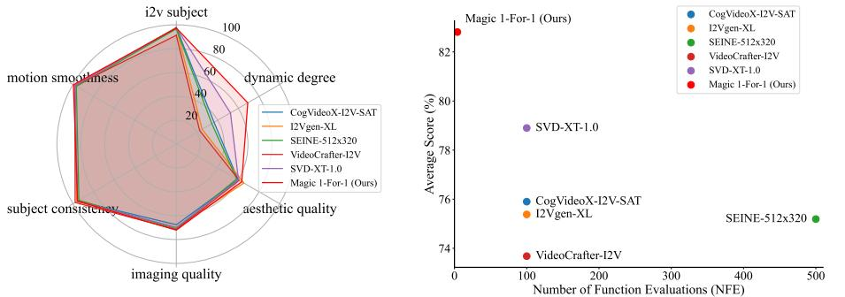
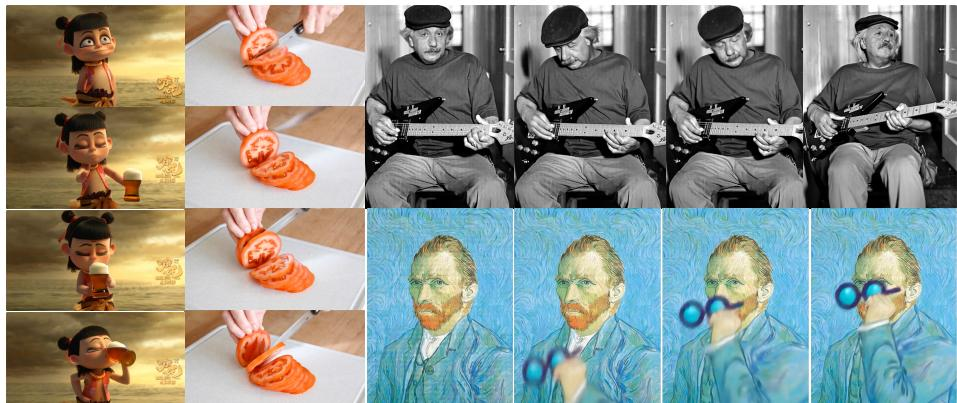
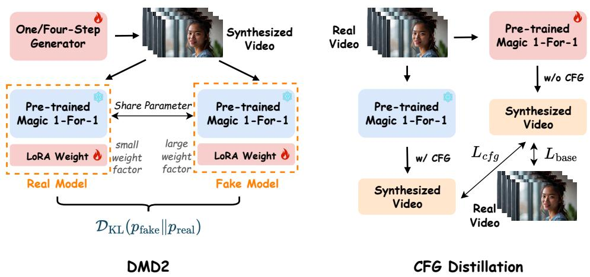
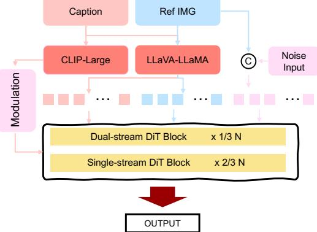
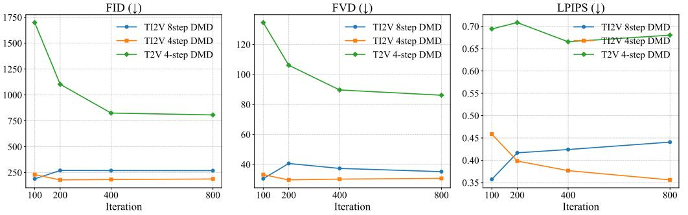
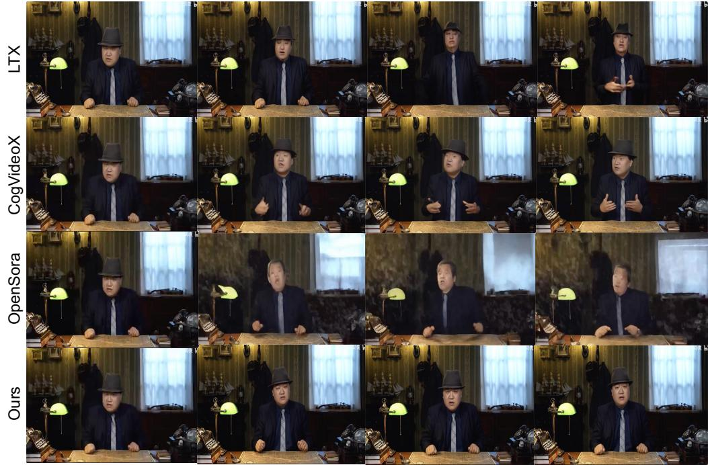

# Magic 1-For-1: Generating One Minute Video Clips within One Minute

Hongwei Yi2 Shitong Shao2 Tian Ye2 Jiantong Zhao2 Qingyu Yin2

Michael Lingelbach2 Li Yuan1 Yonghong Tian1 Enze Xie3 Daquan Zhou1† ∗

1 Peking University 2 Hedra Inc. 3 Nvidia

<https://magic-141.github.io/Magic-141/>

# Abstract

In this technical report, we present Magic 1-For-1 (Magic141), an efficient video generation model with optimized memory consumption and inference latency. The key idea is simple: factorize the text-to-video generation task into two separate easier tasks for diffusion step distillation, namely text-to-image generation and image-to-video generation. We verify that with the same optimization algorithm, the image-to-video task is indeed easier to converge over the text-to-video task. We also explore a bag of optimization tricks to reduce the computational cost of training the image-to-video (I2V) models from three aspects: 1) model convergence speedup by using a multi-modal prior condition injection; 2) inference latency speed up by applying an adversarial step distillation, and 3) inference memory cost optimization with parameter sparsification. With those techniques, we are able to generate 5-second video clips within 3 seconds. By applying a test time sliding window, we are able to generate a minute-long video within one minute with significantly improved visual quality and motion dynamics, spending less than 1 second for generating 1 second video clips on average. We conduct a series of preliminary explorations to find out the optimal tradeoff between computational cost and video quality during diffusion step distillation and hope this could be a good foundation model for open-source explorations. The code and the model weights are available at <https://github.com/DA-Group-PKU/Magic-1-For-1>.

Figure 1: The comparative experimental results on General VBench highlight the strong performance of Magic 1-For-1. Our model surpasses other open-source TI2V models, including CogVideoX-I2V-SAT, I2Vgen-XL, SEINE-512x320, VideoCrafter-I2V, and SVD-XT-1.0, in terms of both performance and efficiency.

This is a technical report used for the description of the efficient image-to-video project implementation.

∗ Project lead. †Corresponding authors.

Figure 2: Magic 1-For-1 can generate video clips with optimized efficiency-quality trade-off.

# 1 Introduction

Recently, diffusion models have demonstrated superior performance in generating high-quality images and videos, with significantly wider diversity over the traditional generative adversarial network (GAN)-based methods [\[4\]](#page-9-0). However, conventional diffusion models require hundreds or thousands of steps to gradually transform noise into structured data, making them computationally expensive, limiting their practical applications. For instance, the recent open-source video generation model [\[18\]](#page-10-0) requires around 8 GPUs and 15 minutes to generate a single 5-second video clip without extra optimization.

Recent works on diffusion step distillation [\[28,](#page-10-1) [31,](#page-10-2) [26,](#page-10-3) [26\]](#page-10-3) aim to accelerate the generative process by reducing the number of inference steps while maintaining high sample quality. However, most of the research works are on image generation. Despite their promise, these methods often compromise video quality and require carefully designed architectures to achieve satisfactory results. As mentioned in SeaweedAPT [\[20\]](#page-10-4), when transferred video generation, most of the one-step video generation algorithms still suffer from significant quality degradation such as motion dynamics and structure.

In this report, we propose to simplify the video generation task by factorizing it into two separate subtasks: text-to-image generation and image-to-video generation. Different from the purpose in Emu Video [? ], which focuses on improving the video generation quality, we focus on reducing the diffusion inference steps. The text-to-image task benefits from its simplicity and a wide range of prior research works, making it inherently simpler and requiring fewer diffusion steps.

We experimentally observe that diffusion step distillation algorithms converge significantly faster in text-to-image generation while also improving the final generation quality. To further reinforce the generative prior, we incorporate multi-modal inputs by augmenting the text encoder with visual inputs. By leveraging quantization techniques, we reduce memory consumption from 40G to 28G and cut the required diffusion steps from 50 to just 4, achieving optimized performance with minimal degradation in quality. In summary, our contributions are:

- Generative Prior Injection: We introduce a novel acceleration strategy for video generation by injecting stronger generative priors through task factorization.
- Multi-Modal Guidance: We propose a multi-modal guidance mechanism that accelerates model convergence by incorporating visual inputs alongside text inputs.
- Comprehensive Optimization: By combining a suite of model acceleration techniques, we achieve state-of-the-art trade-off in terms of both generation quality and inference efficiency.

# 2 Related Works

Video generation has been a rapidly evolving research area, leveraging advancements in deep learning and generative models. Early approaches relied on autoregressive models [\[17\]](#page-10-5), which generate videos frame-by-frame based on past frames, but suffered from compounding errors over time. Variational Autoencoders (VAEs) [\[2\]](#page-9-1) and Generative Adversarial Networks (GANs) [\[34,](#page-10-6) [7\]](#page-9-2) were later introduced to improve video synthesis, offering better visual fidelity but struggling with temporal consistency over longer sequences.

More recent breakthroughs have been driven by Transformer-based architectures and diffusion models. VideoGPT [\[39\]](#page-11-0) adapts GPT-like architectures for video tokenization and synthesis, capturing long-term dependencies effectively. Diffusion models have also demonstrated promising results, with works like Video Diffusion Models (VDMs) [\[12\]](#page-9-3) extending the success of image diffusion models to videos by modeling spatiotemporal dynamics through iterative denoising. Additionally, latent space-based methods such as Imagen Video [\[13\]](#page-9-4) and Make-A-Video [\[30\]](#page-10-7) focus on efficient high-resolution synthesis by operating in a compressed representation space. These methods have significantly advanced the field, enabling the generation of realistic, temporally coherent videos with high fidelity.

Recent advancements in diffusion step distillation have introduced various methods to accelerate the sampling process of diffusion models, aiming to reduce computational costs while maintaining high-quality outputs. Salimans and Ho (2022) proposed Progressive Distillation, which iteratively halves the number of sampling steps required by training student models to match the output of teacher models with more steps, thereby achieving faster sampling without significant loss in image quality [\[28\]](#page-10-1). Meng et al. (2023) developed a distillation approach for classifier-free guided diffusion models, significantly speeding up inference by reducing the number of sampling steps required for high-fidelity image generation [\[21\]](#page-10-8). Geng et al. (2024) introduced a method that distills diffusion models into single-step generator models using deep equilibrium architectures, achieving efficient sampling with minimal loss in image quality [\[9\]](#page-9-5). Watson et al. (2024) proposed EM Distillation, a maximum likelihood-based approach that distills a diffusion model into a one-step generator model, effectively reducing the number of sampling steps while preserving perceptual quality [\[36\]](#page-11-1). Zhou et al. (2024) presented Simple and Fast Distillation (SFD), which simplifies existing distillation paradigms and reduces fine-tuning time by up to 1000 times while achieving high-quality image generation [\[42\]](#page-11-2). Yin et al. (2024) introduced Distribution Matching Distillation (DMD), a procedure to transform a diffusion model into a one-step image generator with minimal impact on image quality [\[40\]](#page-11-3). These developments contribute to making diffusion-based generative models more practical for real-world applications by substantially decreasing computational demands.

# 3 Method

Image Prior Generation We use both diffusion-based and retrieval-based methods for getting the images. We define a unified function G that combines both diffusion-based generation and retrieval-based augmentation:

$$\mathbf{x}_0 = \mathcal{G}(\mathbf{x}_T, y, \mathcal{R}(y); \boldsymbol{\theta}), \tag{l}$$

where xT ∼ N (0, I) represents the initial noise, y is the textual input, R(y) is the retrieved set of relevant images, and θ represents the model parameters. The retrieval function R is formally defined as:

$$\mathcal{R}(y) = \{ \mathbf{r}_i \mid \mathbf{r}_i = \arg\max_{\mathbf{x} \in \mathcal{D}} \text{sim}(\phi(y), \psi(\mathbf{x})) \},\tag{2}$$

where D is the image corpus, ϕ(y) and ψ(x) are text and image embeddings, respectively, and sim(·, ·) is a similarity function (e.g., cosine similarity). The retrieved images serve as additional conditioning signals in the denoising process:

$$\mathbf{x}_{t-1} = \mathbf{x}_t - \alpha_t \epsilon_\theta(\mathbf{x}_t, t, y, \mathcal{R}(y)) + \sigma_t \mathbf{z},\tag{3}$$

where ϵθ is the learned noise prediction model, αt is the step size, σt is the noise variance, and z ∼ N (0, I). This retrieval-augmented diffusion process ensures that the generated image maintains both high fidelity and factual accuracy. Recent methods such as Retrieval-Augmented Diffusion Models (RDM) [\[27\]](#page-10-9) and kNN-Diffusion [\[29\]](#page-10-10) have demonstrated the effectiveness of this approach, significantly improving the realism and contextual alignment of generated images.

Figure 4: The overview of model acceleration techniques, including DMD2 and CFG distillation.

Image Prior Injection and Multi-modal Guidance Design The Image-to-Video (I2V) task involves generating a video that aligns with a given text description, using an input image as the first frame. Specifically, the T2V model takes as input a latent tensor X of shape T × C × H ×W, where T, C, H, and W correspond to the number of frames, channels, height, and width of the compressed video, respectively.

Similar to Emu Video [\[10\]](#page-9-6), to incorporate the image condition I, we treat I as the first frame of the video and apply zero-padding to construct a tensor Io of dimensions T × C × H × W, as shown in Fig. [3.](#page-3-0) Additionally, we introduce a binary mask m with shape T × 1 × H × W, where the first temporal position is set to 1, and all subsequent positions are set to zero. The

Figure 3: Overall Architecture of Magic 1-For-1.

latent tensor X, the padded tensor Io, and the mask m are then concatenated along the channel dimension to form the input to the model.

Since the input tensor's channel dimension increases from C to 2C + 1, as shown in Fig. [3,](#page-3-0) we adjust the parameters of the model's first convolutional module from ϕ = (Cin(= C), Cout, sh, sw) to ϕ ′ = (C ′ in(= 2C + 1), Cout, sh, sw). Here, Cin and C ′ in represent the input channels before and after modification, Cout is the number of output channels, and sh and sw correspond to the height and width of the convolutional kernel, respectively. To preserve the representational capability of the T2V model, the first C input channels of ϕ ′ are copied from ϕ, while the additional channels are initialized to zero. The I2V model is pre-trained on the same dataset as the T2V model to ensure consistency.

To further enhance the semantic alignment of reference images, we extract their embeddings via the vision branch of the VLM text encoder and concatenate them with the text embeddings, as illustrated in Fig. [3.](#page-3-0) This integration improves the model's ability to generate videos that better capture the context provided by both the image and the textual description.

#### 3.1 Diffusion Distillation

The iterative nature of diffusion model inference, characterized by its multi-step sampling procedure, introduces a significant bottleneck to inference speed. This issue is particularly exacerbated in largescale models such as our 13B parameter diffusion model, Magic 1-For-1, where the computational

cost of each individual sampling step is substantial. As depicted in Fig. [4,](#page-3-1) we address this challenge by implementing a dual distillation approach, incorporating both step distillation and CFG distillation to achieve faster sampling. For step distillation, we leverage DMD2, a state-of-the-art algorithm engineered for efficient distribution alignment and accelerated sampling. Inspired by score distillation sampling (SDS) [\[25\]](#page-10-11), DMD2 facilitates step distillation through a coordinated training paradigm involving three distinct models. These include: the one/four-step generator Gϕ, whose parameters are iteratively optimized; the real video model u real θ , tasked with approximating the underlying real data distribution preal; and the fake video model u fake θ , which estimates the generated (fake) data distribution pfake. Crucially, all three models are initialized from the same pre-trained model, ensuring coherence and streamlining the training process. The distribution matching objective for step distillation can be mathematically expressed as:

$$\nabla_{\phi} L_{\text{DMD}} \stackrel{\Delta}{=} \mathbb{E}_{t} \nabla_{\phi} \mathcal{D}_{\text{KL}} \left( p_{\text{fake}} || p_{\text{real}} \right) \approx -\mathbb{E}_{t} \int_{\epsilon} \left( \left[ z_{t} - \sigma_{t} u_{\theta}^{\text{real}}(z_{t}, t) - z_{t} + \sigma_{t} u_{\theta}^{\text{fake}}(z_{t}, t) \right] \frac{\partial G_{\phi}(\epsilon)}{\partial \phi} d\epsilon \right). \tag{4}$$

Here, zt stands for the video latent at the timestep t, and zt = σtz1 + (1−σt)ˆz0, with zˆ0 representing the output synthesized by the few-step generator, and σt denoting the noise schedule. This formulation reframes the conventional score function-based distribution matching (inherent in standard DMD2) into a novel approach that focuses on distribution alignment at time step t = 0. This adaptation is crucial to ensure consistency with the training methodology employed in Magic 1-For-1. Furthermore, DMD2 necessitates the real-time updating of u fake θ to guarantee an accurate approximation of the fake data distribution, pfake. This update is governed by the following loss function:

$$L_{\text{fake}} = \mathbb{E}_{\hat{z}_0, z_1, t \sim [0, 1]} \left[ \left\| z_1 - \hat{z}_0 - u_\theta^{\text{fake}}(z_t, t) \right\|_2^2 \right]. \tag{5}$$

In the practical implementation, training DMD2 requires the simultaneous use of three models, which makes it infeasible to fit the models for standard training even under the ZeRO3 configuration with 2 nodes equipped with 8 GPUs, each having 80GB of memory. To address this limitation, we propose leveraging LoRA to handle parameter updates of the fake model. Additionally, we observed that directly training with the standard DMD2 approach often leads to training collapse. This issue arises because the input to the real model is derived from the output of the few-step generator, whose data distribution differs significantly from the training data distribution used during the pre-training phase. To mitigate this problem, we adopt a straightforward yet effective solution: slightly shifting the parameters of the real model towards those of the fake model. This is achieved by adjusting the weight factor associated with the low-rank branch. This adjustment helps align the data distributions, ensuring stable training.

During the inference phase of diffusion models, Classifier-Free Diffusion Guidance (CFG) [\[14,](#page-9-7) [6\]](#page-9-8) is frequently employed at each sampling step. CFG enhances the fidelity of the generated results with respect to the specified conditions by performing additional computations under dropoutconditioning. To eliminate this computational overhead and boost inference speed, we implemented CFG distillation [\[21\]](#page-10-8). We define a distillation objective that trains the student model, u s θ , to directly produce the guided outputs. Specifically, we minimize the following expectations over timesteps and guidance strengths:

$$L_{\text{cfg}} = \mathbb{E}_{w \sim p_w, t \sim U[0, 1]} \left[ ||\hat{u}_\theta(\mathbf{z}_t, t, w, T_s) - u_\theta^s(\mathbf{z}_t, t, w, T_s)||_2^2 \right],\tag{6}$$

where

$$u\hat{\imath}(\mathbf{z}_t, t, w, T_s) = (1 + w)u_\theta(\mathbf{z}_t, t, T_s) - wu_\theta(\mathbf{z}_t, t, \emptyset) \tag{7}$$

represents the linearly interpolated prediction between conditional and unconditional outputs. Ts stands for the text prompt. In this formulation, pw(w) = U [wmin, wmax] dictates that the guidance strength parameters are sampled uniformly during training, which empowers the distilled model to effectively handle a wide range of guidance scales without necessitating retraining. To integrate the guidance weight, w, we supplied it as an extra input to our student model. This distillation process effectively condenses the traditional CFG calculation into a single, streamlined forward pass. We construct the overall distillation objective, Ldistillation, as a weighted sum of two loss terms. The CFG distillation loss serves to align the student model's outputs with the teacher's guided predictions, while

| #Steps  | Approach                 | i2v Subject (↑) | Subject Consistency (↑) | Motion Smoothness (↑) | Dynamic Degree (↑) | Aesthetic Quality (↑) | Imaging Quality (↑) | Temporal Average Flickering (↑) (↑) |
|---------|--------------------------|--------------------|----------------------------|--------------------------|-----------------------|--------------------------|------------------------|----------------------------------------------|
| 56-step | Euler (baseline)         | 0.9804             | 0.9603                     | 0.9954                   | 0.2103                | 0.5884                   | 0.6896                 | 0.9937 0.7740                             |
| 28-step | Euler (baseline)         | 0.9274             | 0.9397                     | 0.9953                   | 0.2448                | 0.5687                   | 0.6671                 | 0.9935 0.7623                             |
| 16-step | Euler (baseline)         | 0.9750             | 0.9366                     | 0.9957                   | 0.1241                | 0.5590                   | 0.6238                 | 0.9946 0.7441                             |
| 8-step  | Euler (baseline) DMD2 | 0.9787 0.9677   | 0.9000 0.9634           | 0.9962 0.9945         | 0.0068 0.3207      | 0.4994 0.5993         | 0.5013 0.7125       | 0.9961 0.6969 0.9921 0.7928         |
| 4-step  | Euler (baseline) DMD2 | 0.9803 0.9812   | 0.8593 0.9762           | 0.9965 0.9934         | 0.0034 0.4123      | 0.4440 0.6123         | 0.3693 0.7234       | 0.9972 0.6642 0.9950 0.8134         |

Table 1: Quantitative results comparison using Magic 1-For-1 on our customized VBench. Each sample follows VBench [\[10\]](#page-9-6) to synthesize 5 videos to avoid errors.

a base prediction loss ensures the student maintains the teacher's underlying generation capabilities. The complete distillation loss is therefore given by:

$$L_{\text{disillation}} = \lambda_{\text{cfg}} L_{\text{cfg}} + L_{\text{base}},\tag{8}$$

where

$$L_{\text{base}} = \mathbb{E}_{z_0, z_1, t \sim [0, 1]} \left[ \left\| z_1 - z_0 - u_\theta^s(z_t, t, T_s) \right\|_2^2 \right]. \tag{9}$$

Here, λcfg is the balancing coefficient for overall distillation loss.

#### 3.2 Model Quantization

We leverage the optimum-quanto framework for model quantization, employing int8 weight-only quantization to minimize the model's memory footprint. The quantization strategy specifically targets the denoising network, encompassing the transformer blocks, the text encoder, and the VLM encoder. The quantization process maps the original bfloat16 weights to int8 values. A common approach involves scaling the bfloat16 values to a suitable range before conversion. For instance, one might determine the maximum absolute value within a tensor of weights, scale all weights such that this maximum value corresponds to the maximum representable int8 value (127 or -128), and then perform the conversion. A simplified illustration of this scaling could be represented as:

$$w_{\rm int8} = \text{round}\left(w_{\rm bf16} \times \frac{127}{\max(|w_{\rm bf16}|)}\right) \tag{10}$$

where wbf16 represents the original bfloat16 weight, wint8 the quantized int8 weight, and max(|wbf16|) the maximum absolute value within the weight tensor. In practice, more sophisticated methods like per-channel quantization or quantization aware training can be used for better performance. To mitigate potential CUDA errors and ensure numerical stability during inference, all linear layers within the model initially convert their inputs to bfloat16 before performing the matrix multiplication with the quantized int8 weights. This bfloat16-int8 multiplication helps maintain accuracy while still benefiting from the reduced memory footprint of the int8 weights.

Before quantization, the model's weights occupy approximately 32GB. After applying int8 quantization, the model size is reduced to about 16GB. During runtime, the peak memory usage is around 30GB. This optimized model is then capable of running on consumer-grade and inference-focused GPUs, including the RTX 5090, A10, and L20.

# 4 Experiments

#### 4.1 Experimental Setup

Foundation Model Selection The text to image generation task is better explored, compared to image to video generation task. Thus, we use a pool of pre-trained T2I models [\[19,](#page-10-12) [23,](#page-10-13) [37,](#page-11-4) [1\]](#page-9-9) or user provided images directly. For I2V task, we use the pre-trained T2V HunyuanVideo 13B model [\[18\]](#page-10-0) as the base model and modify based on it.

#### 4.2 Implementation Details

We use 128 GPUs with a batch size 64. We train the model for two weeks. The initial learning rate is set to be 5 × 10−5 and progressively decrease to 1 × 10−5 . We also apply exponential moving

Figure 5: Model performance progression during training. Interestingly, T2V Magic 1-For-1 exhibits considerably slower convergence in step distillation compared to TI2V Magic 1-For-1.

average (EMA) [\[22\]](#page-10-14) for stable training. The model was trained on a subset with 1.6M data samples collected from WebVid-10M [\[3\]](#page-9-10), Panda-70M [\[5\]](#page-9-11), Koala-36M [\[35\]](#page-11-5), and the Internet data. For step distillation, we explore the integration of CFG distillation into the training process of DMD2, aiming to produce a few-step generator within a single stage of training. DMD2 is trained with a batch size of 16 and a fixed learning rate of 2 × 10−6 . During training, the few-step generator is updated after every five updates of the fake model. Additionally, in DMD2 training, the weight factor for the low-rank branch is set to 0.25 for the real model and 1 for the fake model, respectively.

#### 4.3 Benchmarks

We utilize our customized VBench, General VBench, and traditional metrics such as FID, FVD, and LPIPS to evaluate the performance of the model. However, due to resource constraints, we do not employ the model with an extensive number of inference steps, as is done in recent state-of-the-art models like MovieGen [\[24\]](#page-10-15). Instead, our focus is directed toward the efficiency aspect of the model. In this report, we conduct performance measurements of the base model using 4, 8, 16, 28, and 56 steps. For the few-step generator, we evaluate its performance using 4 and 8 steps.

Our Customized VBench. We use I2V VBench for portrait video synthesis evaluation [\[16\]](#page-9-12). We first collect 58 high-quality widescreen images and leverage InternVL-26B to generate corresponding prompts for these images. For each sample, we then synthesize five videos, resulting in a total of 290 videos, to reduce potential testing errors. The synthesized videos are subsequently evaluated using VBench. The primary evaluation metrics include i2v subject, subject consistency, motion smoothness, dynamic degree, aesthetic quality, imaging quality, and temporal flickering.

General VBench. We also evaluate Magic 1-For-1's performance on the General VBench [\[15\]](#page-9-13) dataset, which consists of the official prompts paired with reference images. Similar to the I2V-VBench evaluation, this benchmark assesses i2v subject, subject consistency, motion smoothness, dynamic degree, aesthetic quality, imaging quality, and temporal flickering. Notably, this benchmark includes 1,118 prompts, each paired with a reference image, to provide a diverse and comprehensive evaluation.

FID, FVD and LPIPS. In portrait video synthesis, key metrics for evaluating video quality include FID [\[11\]](#page-9-14), FVD [\[33\]](#page-10-16), and LPIPS [\[41\]](#page-11-6). Following the approaches outlined in EMO [\[32\]](#page-10-17) and Hallo [\[8\]](#page-9-15), we randomly sample 100 video clips from the VFHQ [\[38\]](#page-11-7) dataset. Each selected clip contains 129 frames, with resolution and frame rate standardized to 540×960 and 24 FPS, respectively. To evaluate performance, we calculate the FID and FVD scores by comparing the synthesized videos against their corresponding original videos.

#### 4.4 Experiment Results

Our experiments contains three primary components. First, ablation studies reveal that the 4-step DMD2 training achieves optimal performance, and that TI2V step distillation is significantly less challenging to train compared to T2V step distillation. Next, we evaluate the performance differences between the few-step generator and the base model on both portrait video synthesis and general video synthesis tasks. Lastly, we compare Magic 1-For-1 with other state-of-the-art TI2V models to demonstrate the superiority of our proposed algorithm.

Convergence Speed Comparison. Due to the powerful generative capabilities of the Magic 1-For-1 base model, fine-tuning this large-scale model to enable high-quality synthetic video generation with minimal sampling steps requires relatively low computational overhead. As shown in Fig. [5,](#page-6-0) applying DMD2 for step distillation on the TI2V base model achieves near convergence within 100 iterations. Specifically, the optimal 4-step generator is obtained at 200 iterations, while the optimal 8-step generator is achieved at merely 100 iterations. Notably, whereas DMD2 demonstrates rapid convergence on the TI2V few-step synthesis task, its performance on the T2V few-step synthesis task remains far from convergence even after 1,000 iterations and significantly underperforms compared to the TI2V counterpart.

Figure 6: Qualitative comparison of Magic 1-For-1 with recent state-of-the-art open source image-tovideo generation models.

Performance Comparison between Few-Step Generators. We evaluate the performance of our few-step generator and base model on both our customized VBench and the General VBench. Our customized VBench is specifically designed for portrait video synthesis tasks, while the General VBench targets generic video generation. The comparative results are presented in Table [1](#page-5-0) and Fig. [1,](#page-0-0) respectively. From Table [1,](#page-5-0) it can be observed that the base model's performance gradually improves as the number of sampling steps increases. Notably, the 50-step base model underperforms the 4-step generator across metrics such as motion dynamics, visual quality, and semantic faithfulness, indicating that our improved DMD2 effectively mitigates certain detrimental biases inherent in the base model. Moreover, Magic 1-For-1 (DMD2) demonstrates strong performance on the general VBench benchmark. As illustrated in Fig. [1,](#page-0-0) Magic 1-For-1 (DMD2) outperforms competing methods—including SVD-XT-1.0, VideoCrafter-I2V, SEINE-512x320, I2Vgen-XL, and CogVideoX-I2V—across multiple evaluation dimensions such as motion dynamics and visual fidelity. This success underscores the superiority of Magic 1-For-1 in TI2V generation tasks.

Performance Comparison With SOTA Models. We also compare the visual quality of our model with recent open-source image-to-video generation models. As shown in Fig. [6,](#page-7-0) our model demonstrates significantly superior video quality, particularly in terms of visual clarity and motion smoothness. [2](#page-8-0)

# 5 Conclusion

In this report, we present a comprehensive approach to enhance the efficiency of video generation model training and inference. We decompose the text-to-video generation task into two sequential subtasks: image generation and image-to-video generation. Our findings demonstrate that the commonly used diffusion step distillation algorithm achieves significantly faster convergence when applied to image-to-video generation compared to the full text-to-video generation pipeline. Furthermore, by incorporating quantization techniques, we develop a highly efficient video generation model while maintaining an acceptable level of generation quality. Through this report, we aim to highlight that by leveraging generation-prior information, the diffusion process can be substantially accelerated, making video generation both faster and more practical.

# 6 Limitation

Due to resource limitations, we trained the model on 540×960 videos using a small, unbalanced dataset. The dataset consists of more human-centric subjects and movie-style video clips over the rest of the categories, leading to a noticeable bias in the model's performance toward these categories. We believe that training on a more balanced dataset with greater diversity would significantly enhance the model's generalization ability further.

2 Please refer to our project page for more visual comparisons. Project page: [https://magic-141.github.](https://magic-141.github.io/Magic-141/) [io/Magic-141/](https://magic-141.github.io/Magic-141/)

# References

- [1] Lets Build Your Ai and We Build Ai. Dall· e 3 system card by admin no comments.
- [2] Mohammad Babaeizadeh, Chelsea Finn, Dumitru Erhan, Roy H Campbell, and Sergey Levine. Stochastic variational video prediction. *arXiv preprint arXiv:1710.11252*, 2017.
- [3] Max Bain, Arsha Nagrani, Gül Varol, and Andrew Zisserman. Frozen in time: A joint video and image encoder for end-to-end retrieval. In *ICCV*, 2021.
- [4] Andrew Brock, Jeff Donahue, and Karen Simonyan. Large scale gan training for high fidelity natural image synthesis. *arXiv preprint arXiv:1809.11096*, 2018.
- [5] Tsai-Shien Chen, Aliaksandr Siarohin, Willi Menapace, Ekaterina Deyneka, Hsiang-Wei Chao, Byung Eun Jeon, Yuwei Fang, Hsin-Ying Lee, Jian Ren, Ming-Hsuan Yang, and Sergey Tulyakov. Panda-70m: Captioning 70m videos with multiple cross-modality teachers. In *2024 IEEE/CVF Conference on Computer Vision and Pattern Recognition (CVPR)*, page 13320–13331. IEEE, June 2024.
- [6] Hyungjin Chung, Jeongsol Kim, Geon Yeong Park, Hyelin Nam, and Jong Chul Ye. Cfg++: Manifold-constrained classifier free guidance for diffusion models. *arXiv preprint arXiv:2406.08070*, 2024.
- [7] Alexia Jolicoeur-Martineau Clark, Léonard Oudot, Julien La Jeune, and Christopher Pal. Adversarial video generation on complex datasets. *arXiv preprint arXiv:1907.06571*, 2019.
- [8] Jiahao Cui, Hui Li, Yao Yao, Hao Zhu, Hanlin Shang, Kaihui Cheng, Hang Zhou, Siyu Zhu, and Jingdong Wang. Hallo2: Long-duration and high-resolution audio-driven portrait image animation. *arXiv preprint arXiv:2410.07718*, 2024.
- [9] Zhengyang Geng, Ashwini Pokle, and J. Zico Kolter. One-step diffusion distillation via deep equilibrium models. *arXiv preprint arXiv:2401.08639*, 2024.
- [10] Rohit Girdhar, Mannat Singh, Andrew Brown, Quentin Duval, Samaneh Azadi, Sai Saketh Rambhatla, Akbar Shah, Xi Yin, Devi Parikh, and Ishan Misra. Emu video: Factorizing text-to-video generation by explicit image conditioning. *arXiv preprint arXiv:2311.10709*, 2023.
- [11] Martin Heusel, Hubert Ramsauer, Thomas Unterthiner, Bernhard Nessler, and Sepp Hochreiter. Gans trained by a two time-scale update rule converge to a local nash equilibrium. In *Neural Information Processing Systems*, volume 30, Long Beach Convention Center, Long Beach, Dec. 2017. NeurIPS.
- [12] J Ho, T Salimans, A Gritsenko, W Chan, M Norouzi, and DJ Fleet. Video diffusion models. arxiv 2022. *arXiv preprint*, 2022.
- [13] Jonathan Ho, William Chan, Chitwan Saharia, Jay Whang, Ruiqi Gao, Alexey Gritsenko, Diederik P Kingma, Ben Poole, Mohammad Norouzi, David J Fleet, et al. Imagen video: High definition video generation with diffusion models. *arXiv preprint*, 2022.
- [14] Jonathan Ho and Tim Salimans. Classifier-free diffusion guidance. *arXiv preprint arXiv:2207.12598*, 2022.
- [15] Ziqi Huang, Yinan He, Jiashuo Yu, Fan Zhang, Chenyang Si, Yuming Jiang, Yuanhan Zhang, Tianxing Wu, Qingyang Jin, Nattapol Chanpaisit, Yaohui Wang, Xinyuan Chen, Limin Wang, Dahua Lin, Yu Qiao, and Ziwei Liu. VBench: Comprehensive benchmark suite for video generative models. In *Proceedings of the IEEE/CVF Conference on Computer Vision and Pattern Recognition*, 2024.
- [16] Ziqi Huang, Fan Zhang, Xiaojie Xu, Yinan He, Jiashuo Yu, Ziyue Dong, Qianli Ma, Nattapol Chanpaisit, Chenyang Si, Yuming Jiang, Yaohui Wang, Xinyuan Chen, Ying-Cong Chen, Limin Wang, Dahua Lin, Yu Qiao, and Ziwei Liu. Vbench++: Comprehensive and versatile benchmark suite for video generative models. *arXiv preprint arXiv:2411.13503*, 2024.
- [17] Nal Kalchbrenner, Aaron van den Oord, Karen Simonyan, et al. Video pixel networks. *International Conference on Machine Learning*, pages 1771–1779, 2017.
- [18] Weijie Kong, Qi Tian, Zijian Zhang, Rox Min, Zuozhuo Dai, Jin Zhou, Jiangfeng Xiong, Xin Li, Bo Wu, Jianwei Zhang, et al. Hunyuanvideo: A systematic framework for large video generative models. *arXiv preprint arXiv:2412.03603*, 2024.
- [19] Black Forest Labs. Flux, 2024.
- [20] Shanchuan Lin, Xin Xia, Yuxi Ren, Ceyuan Yang, Xuefeng Xiao, and Lu Jiang. Diffusion adversarial post-training for one-step video generation. *arXiv preprint arXiv:2501.08316*, 2025.
- [21] Chenlin Meng, Robin Rombach, Ruiqi Gao, Diederik Kingma, Stefano Ermon, Jonathan Ho, and Tim Salimans. On distillation of guided diffusion models. In *Proceedings of the IEEE/CVF Conference on Computer Vision and Pattern Recognition*, pages 14297–14306, 2023.
- [22] Daniel Morales-Brotons, Thijs Vogels, and Hadrien Hendrikx. Exponential moving average of weights in deep learning: Dynamics and benefits. *Transactions on Machine Learning Research*, 2024.
- [23] Dustin Podell, Zion English, Kyle Lacey, Andreas Blattmann, Tim Dockhorn, Jonas Müller, Joe Penna, and Robin Rombach. Sdxl: Improving latent diffusion models for high-resolution image synthesis. *arXiv preprint*, 2023.
- [24] Adam Polyak, Amit Zohar, Andrew Brown, Andros Tjandra, Animesh Sinha, Ann Lee, Apoorv Vyas, Bowen Shi, Chih-Yao Ma, Ching-Yao Chuang, et al. Movie gen: A cast of media foundation models. *arXiv preprint arXiv:2410.13720*, 2024.
- [25] Ben Poole, Ajay Jain, Jonathan T. Barron, and Ben Mildenhall. Dreamfusion: Text-to-3d using 2d diffusion. In *International Conference on Learning Representations*, kigali, rwanda, May 2023. OpenReview.net.
- [26] Robin Rombach, Andreas Blattmann, Dominik Lorenz, Patrick Esser, and Björn Ommer. High-resolution image synthesis with latent diffusion models. *Proceedings of the IEEE/CVF Conference on Computer Vision and Pattern Recognition*, pages 10684–10695, 2022.
- [27] Robin Rombach, Andreas Blattmann, and Björn Ommer. Text-guided synthesis of artistic images with retrieval-augmented diffusion models. *arXiv preprint arXiv:2207.13038*, 2022.
- [28] Tim Salimans and Jonathan Ho. Progressive distillation for fast sampling of diffusion models. *arXiv preprint arXiv:2202.00512*, 2022.
- [29] Shelly Sheynin, Oron Ashual, Adam Polyak, et al. knn-diffusion: Image generation via large-scale retrieval. *arXiv preprint arXiv:2204.02849*, 2022.
- [30] Uriel Singer, Adam Polyak, Thomas Hayes, Xi Yin, Jie An, Songyang Zhang, Qiyuan Hu, Harry Yang, Oron Ashual, Oran Gafni, et al. Make-a-video: Text-to-video generation without text-video data. *arXiv preprint*, 2022.
- [31] Yang Song, Prafulla Dhariwal, Mark Chen, and Ilya Sutskever. Consistency models. *arXiv preprint arXiv:2303.01469*, 2023.
- [32] Xusen Sun, Longhao Zhang, Hao Zhu, Peng Zhang, Bang Zhang, Xinya Ji, Kangneng Zhou, Daiheng Gao, Liefeng Bo, and Xun Cao. Vividtalk: One-shot audio-driven talking head generation based on 3d hybrid prior. *arXiv preprint arXiv:2312.01841*, 2023.
- [33] Thomas Unterthiner, Sjoerd van Steenkiste, Karol Kurach, Raphaël Marinier, Marcin Michalski, and Sylvain Gelly. Fvd: A new metric for video generation. 2019.
- [34] Carl Vondrick, Hamed Pirsiavash, and Antonio Torralba. Generating videos with scene dynamics. *Advances in Neural Information Processing Systems*, pages 613–621, 2016.
- [35] Qiuheng Wang, Yukai Shi, Jiarong Ou, Rui Chen, Ke Lin, Jiahao Wang, Boyuan Jiang, Haotian Yang, Mingwu Zheng, Xin Tao, et al. Koala-36m: A large-scale video dataset improving consistency between fine-grained conditions and video content. *arXiv preprint arXiv:2410.08260*, 2024.
- [36] Ben Watson, Diederik P. Kingma, and Tim Salimans. Em distillation for one-step diffusion models. *arXiv preprint arXiv:2405.16852*, 2024.
- [37] Enze Xie, Junsong Chen, Junyu Chen, Han Cai, Haotian Tang, Yujun Lin, Zhekai Zhang, Muyang Li, Ligeng Zhu, Yao Lu, et al. Sana: Efficient high-resolution image synthesis with linear diffusion transformers. *arXiv preprint arXiv:2410.10629*, 2024.
- [38] Liangbin Xie, Xintao Wang, Honglun Zhang, Chao Dong, and Ying Shan. Vfhq: A high-quality dataset and benchmark for video face super-resolution. In *Proceedings of the IEEE/CVF Conference on Computer Vision and Pattern Recognition*, pages 657–666, 2022.
- [39] William Yan, Patrick Esser, Yilun Yang, Bjorn Ommer, and Alexander Lee. Videogpt: Video generation using vq-vae and transformers. *arXiv preprint arXiv:2104.10157*, 2021.
- [40] Hong Yin, Yizhu Zhang, Yifan Zhang, Yiran Zhang, Yixin Zhang, Yifan Zhang, Yizhu Zhang, Yiran Zhang, and Yixin Zhang. One-step diffusion with distribution matching distillation. In *Proceedings of the IEEE/CVF Conference on Computer Vision and Pattern Recognition*, 2024.
- [41] Richard Zhang, Phillip Isola, Alexei A Efros, Eli Shechtman, and Oliver Wang. The unreasonable effectiveness of deep features as a perceptual metric. In *Proceedings of the IEEE conference on computer vision and pattern recognition*, pages 586–595, 2018.
- [42] Zhenyu Zhou, Defang Chen, Can Wang, Chun Chen, and Siwei Lyu. Simple and fast distillation of diffusion models. *arXiv preprint arXiv:2409.19681*, 2024.