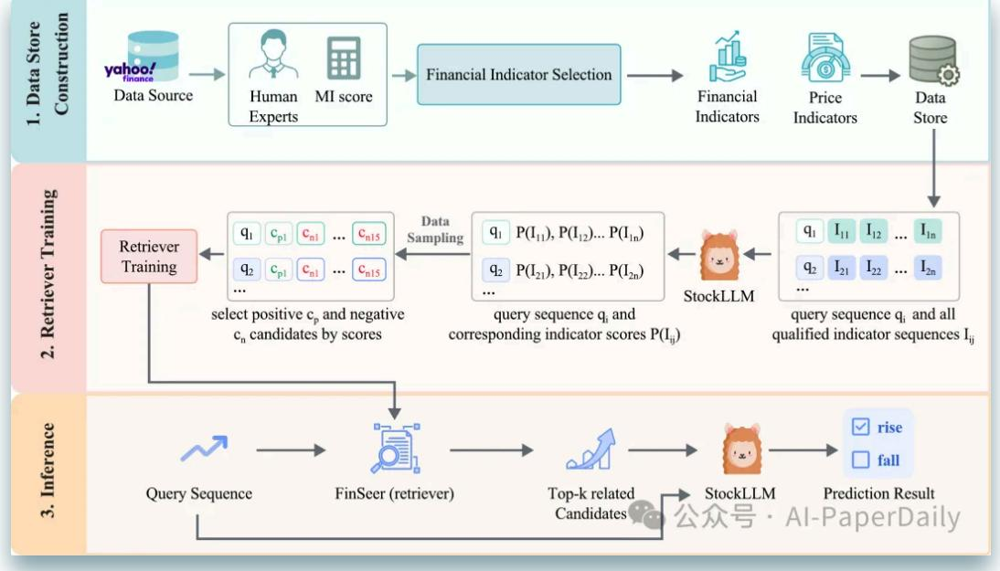
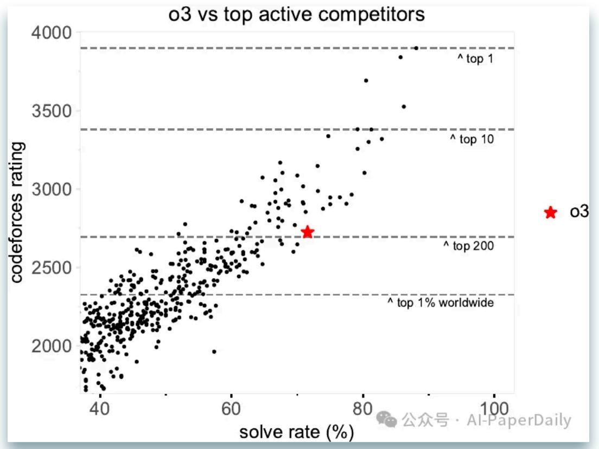
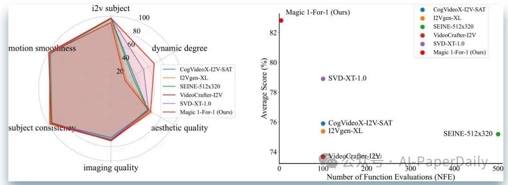

## 【论文日报】LLM合集:首个股票预测 RAG 框架震撼登场,炒股从 此不迷茫!

Original AI-PaperDaily [AI-PaperDaily](javascript:void(0);) 2025年02月12日 19:09

## **1. Retrieval-augmented Large Language Models for Financial Time Series Forecasting**

股票动量预测是金融时间序列预测里很基础的一项任务,要从大量时间序列数 据里找出关键影响因素。不过,现在那些基于文本训练或者数值相似性的检索 方法,在处理复杂金融分析时,效果不太理想。

为了解决这个问题,我们提出了首个用于金融时间序列预测的检索增强生成 (RAG)框架,这里面有三个关键创新点: 第一,用一个微调后的10亿参数 大型语言模型(StockLLM)作为核心; 第二,想出了一种新方法,能借助大 型语言模型的反馈来选择候选; 第三,设立了一个训练目标,让查询和历史上 重要序列之间的相似性最大化。这样一来,我们的检索器FinSeer就能在复杂金 融数据里找到有价值的模式,还能减少干扰信息。

我们还专门构建了新数据集,把财务指标和历史股票价格结合起来,训练 FinSeer,保证评估结果可靠。实验结果显示,我们这个RAG框架比单独用 StockLLM和随机检索效果要好,证明了它的有效性。FinSeer也超过了现有的 检索方法,在BIGDATA22上准确率提高了8%,还能检索出更有影响力的序 列。

论文: https://arxiv.org/pdf/2502.05878

**2. Competitive Programming with Large Reasoning Models**

我们发现,把强化学习用在大语言模型(LLMs)上,能让它在复杂的编码和 推理任务里,表现有明显提升。

另外,我们对比了两种常见的推理模型,OpenAI的o1和早期的o3检查点,还和 一个专门针对特定领域的系统o1-ioi做了比较。o1-ioi采用了专门为参加2024年 国际信息学奥林匹克竞赛(IOI)设计的推理策略。

我们带着o1-ioi参加了2024年的IOI,用了精心设计的测试策略,最终成绩排在 了前49%。要是竞赛条件更宽松些,o1-ioi能拿到金牌。不过,在评估o3这类更 新的模型时,我们发现,o3就算没有专门设计的领域策略,也不受宽松条件限 制,依然能拿到金牌。

从这些结果能看出,虽说像o1-ioi这种专门的流程,能带来很大改进,但o3这 种不断升级的通用模型,不依赖那些人为设计的推理技巧,也能取得更好的成 绩。更厉害的是,o3在2024年IOI里拿到了金牌,在Codeforces上的评分也和顶 尖人类选手差不多。

## 论文: https://arxiv.org/pdf/2502.06807

**3. Magic 1-For-1: Generating One Minute Video Clips within One Minute**

在本文里,我们提出了Magic 1-For-1(简称Magic141),这是个高效的视频生 成模型,在内存消耗和推理延迟方面都做了优化。

它的核心思路很简单,就是把从文本生成视频这个任务,拆成两个相对容易的 任务,也就是对扩散步骤进行蒸馏,分别是从文本生成图像,再从图像生成视 频。经过验证,在同样的优化算法下,从图像生成视频这个任务,确实比直接 从文本生成视频更容易实现收敛。

为了降低训练图像到视频(I2V)模型的计算成本,我们还研究了一系列优化 技巧,主要从三个方面入手:

1. 利用多模态先验条件注入,加快模型收敛速度;

2. 通过对抗性步骤蒸馏,减少推理延迟;

3. 采用参数稀疏化,优化推理时的内存成本。

靠这些技术,我们能在3秒内生成5秒的视频片段。要是用测试时间滑动窗口的 方法,一分钟就能生成一分钟时长的视频,而且视觉质量和运动效果都有明显 提升,平均下来生成1秒视频片段用不了1秒。

我们做了好些初步探索,就想在扩散步骤蒸馏过程中,找到计算成本和视频质 量之间的最佳平衡点,希望这个模型能给开源探索打下个好基础。代码和模型 权重可以在https://github.com/DA-Group-PKU/Magic-1-For-1 这里获取。

论文: https://arxiv.org/pdf/2502.07701

2/17/25, 9:22 AM 【论文日报】LLM合集:首个股票预测 RAG 框架震撼登场,炒股从此不迷茫!

**4. LLMs Can Easily Learn to Reason from Demonstrations**

**Structure, not content, is what matters!**

| Original                                                      | Deleted Steps                                                 | Inserted Steps                            | Shuffled Steps                  |
|---------------------------------------------------------------|---------------------------------------------------------------|-------------------------------------------|---------------------------------|
| l believe 1+1=3                                               | l believe 1+1=3                                               | l believe 1+1=3                           | Alternatively, consider 2-1=1   |
| But wait, 3-1=2 so that's wrong                               | 2                                                             | Wait, the sum of angles is 90°            | Yes, that's correct: 1+1 = 2    |
| Alternatively, consider 2-1=1 Yes, that's correct: 1+1 = 2 | Alternatively, consider 2-1=1 Yes, that's correct: 1+1 = 2 | Alternatively Yes, that's correct: 1+7 | I believe 1+1=3                 |
|                                                               |                                                               |                                           | But wait, 3-1=2 so that's wrong |

大推理模型(LRMs)能解决复杂的推理问题,靠的是遵循长链推理(Long CoT),这个长链里包含了反思、回溯和自我验证这些环节。不过,怎么通过 训练让模型掌握Long CoT,还有训练需要多少数据,大家了解得还不多。

在这篇文章里,我们发现大型语言模型(LLM)能通过数据高效监督微调

(SFT)和参数高效低秩适应(LoRA),有效学会Long CoT推理。只用了 17000个长链推理训练样本,Qwen2.5 - 32B - Instruct模型在很多数学和编程测 试里,成绩都有明显提升。像在AIME 2024里,成绩从原来的基础上提高了 40.0%,达到56.7%;在LiveCodeBench里提高了8.1%,达到57.0% ,和专有的 o1 - preview模型44.6%和59.1%的得分已经很接近了。

更关键的是,我们发现Long CoT的结构对学习过程特别重要,相比之下,单个 推理步骤里具体写了什么,影响反而没那么大。比如说,训练的时候用错的样 本,或者把推理关键词去掉,对模型性能影响不大。但要是改变Long CoT的逻 辑结构,比如重新排列推理步骤,或者删掉某些步骤,模型的准确率就会大幅 下降。打个比方,用答案错误的长链推理样本训练模型,它的准确率只比用完 全正确样本训练的模型低3.2个百分点。

这些发现让我们对怎么激发LLMs的推理能力,有了更深入的理解,也让我们 清楚了,训练下一代推理模型时,哪些因素是必须重点考虑的。这篇论文是关 于我们之前发布的Sky - T1 - 32B - Preview模型的。代码可以在 https://github.com/NovaSky-AI/SkyThought 这里获取。

论文: https://arxiv.org/pdf/2502.07374

点击关注AI-PaperDaily公众号获取更多技术信息~

## AI-PaperDaily

专注搜索、广告、推荐、大模型和人工智能最新技术,欢迎关注我 219篇原创内容

公众号

大模型最新论文 104 炒股 1

大模型最新论文 · 目录

- 上一篇
【论文日报】LLM合集:LM2 模型 给 Transformer加上记忆模块,性能飙升… 下一篇

【论文日报】LLM合集:MLA 技术在 DeepSeek-R1 大显神通,清华 TransMLA 将