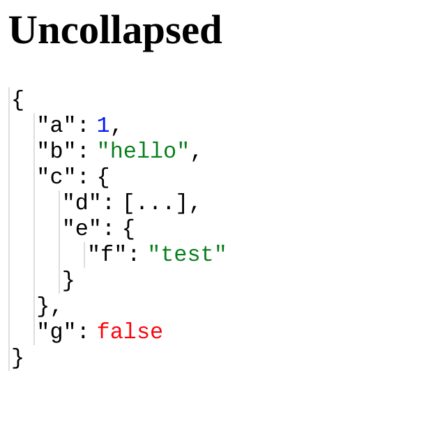
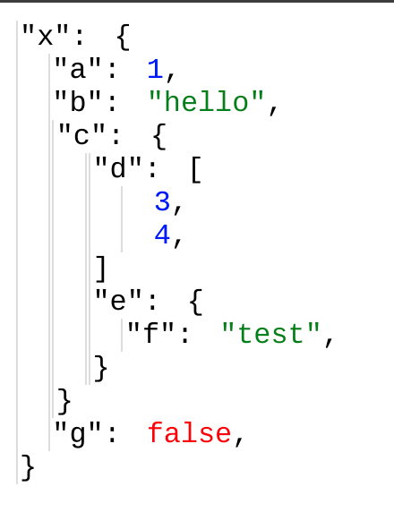

# Vue 3 + Vite

This template should help get you started developing with Vue 3 in Vite. The template uses Vue 3 `<script setup>` SFCs, check out the [script setup docs](https://v3.vuejs.org/api/sfc-script-setup.html#sfc-script-setup) to learn more.

## Recommended IDE Setup

- [VS Code](https://code.visualstudio.com/) + [Vue - Official](https://marketplace.visualstudio.com/items?itemName=Vue.volar) (previously Volar) and disable Vetur

This Tree component is a rewrite of PrintObject in Vue 3. 

    PrintObject - is a component that can display a javascript object, it uses in-direct recursion to diplay subojbects. This in-direct recursion works well in Vue 2 but stopped working in Vue 3 due to the rendering function starts before Props is avaialbe. 

Vue 3 supports recursion within the component ,  
        Tree.vue
                <template>
                        ... 
                        <tree/> 
                <template> 

Tree.vue replaces the original RenderKeyValue.js and RenderObject.vue which worked as indirect recursion.

Below is an object without styling 

after applied styling

hocked event like on-click mouse move over and leave
  

well done!!!