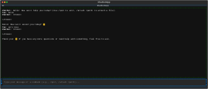

# Building an AI-Powered Terminal-Based Chatbot

Just built an AI-powered terminal-based chatbot in hours using **Textual** and a local **Ollama** instance, with a little help from **Grok (xAI)**! This project indexes chat history and files, connects to a local LLM for smart responses, and is ready to scale with **Elasticsearch**. 

The best part? From concept to working GUI, it took less than a day—proof of how AI can accelerate development without sacrificing functionality.

## Next Steps: Integrating Elasticsearch

Integrating Elasticsearch for advanced search and analytics is the next exciting step. **Elasticsearch** will make it easier to:
- Search for swap wrappers.
- Analyze trades efficiently.
- Present data in a human-readable format for better insights.

Excited to see where this goes! 

---

**#AI #Python #Textual #Ollama #Elasticsearch #Innovation**

