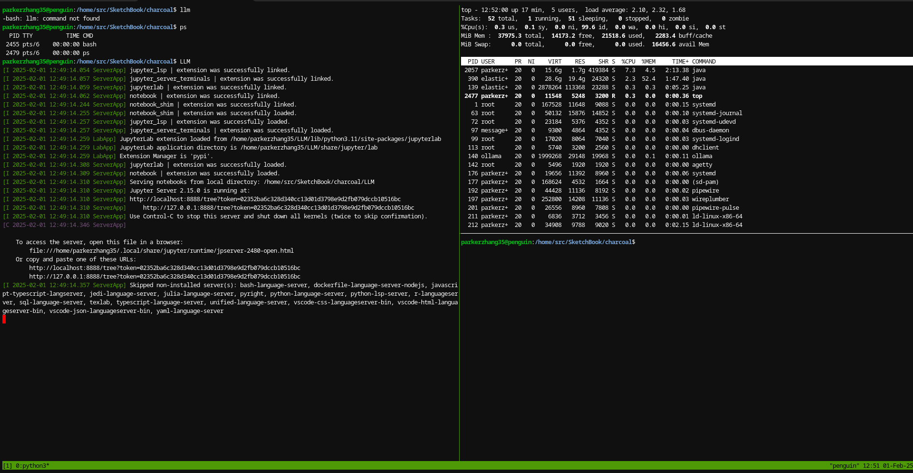

**
1. Tmux is a terminal multiplexer.  Think of it as a way to supercharge your terminal and make it much more versatile.  It lets you create and manage multiple "windows" and "panes" within a single terminal session.  Here's a breakdown of what that means and why it's useful:

* **Multiple Windows:** Imagine having several separate terminal windows open, but all contained within a single terminal application.  Tmux lets you do this.  You can switch between these windows easily, keeping different tasks organized.  For example, you could have one window for editing code, another for running tests, and a third for monitoring server logs.

* **Panes:**  Within each window, you can split the screen into multiple panes.  This is like having multiple terminal sessions visible at the same time within the same window.  You can arrange these panes horizontally or vertically, allowing you to see and interact with different processes simultaneously.  For instance, you might have a code editor in one pane and a running application in another.

* **Persistence:**  One of the most powerful features of tmux is that your sessions are persistent.  If you get disconnected from your server or close your terminal, your tmux session and all its windows and panes will still be there when you reconnect.  This is incredibly useful for long-running processes or when working on remote machines.

* **Detaching and Attaching:** You can detach from a tmux session, leaving it running in the background.  Later, you can reattach to the same session and continue working where you left off.  This is great for managing long-term tasks without having to keep your terminal constantly open.

In essence, tmux gives you a way to manage multiple terminal sessions within a single window, keep those sessions running even if you disconnect, and easily switch between them.  It's a powerful tool for developers, system administrators, and anyone who works extensively in the terminal.

2. Installing tmux**

  * **On Linux (using your Chromebook's Linux environment):**

    ```bash
    sudo apt-get update
    sudo apt-get install tmux
    ```

  * **On macOS (if you're not using your Chromebook):**

    ```bash
    brew install tmux
    ```

**2. Finding a tmux Cheatsheet**

There are many great tmux cheat sheets available online. Here are a few popular options:

  * **Visual tmux cheat sheet:**  [https://tmuxcheatsheet.com/](https://www.google.com/url?sa=E&source=gmail&q=https://tmuxcheatsheet.com/) - This site provides a clear, interactive cheat sheet with explanations.

  * **Daniel Miessler's cheat sheet:** [https://danielmiessler.com/study/tmux/](https://www.google.com/url?sa=E&source=gmail&q=https://danielmiessler.com/study/tmux/) - This is a comprehensive guide with detailed explanations and examples.

  * **Tmux shortcuts & cheatsheet:** [https://gist.github.com/MohamedAlaa/2961058](https://www.google.com/url?sa=E&source=gmail&q=https://gist.github.com/MohamedAlaa/2961058) - A concise list of essential commands in a GitHub gist.

You can also find cheat sheets in PDF format or even create your own as you learn more about tmux.

**3. Getting Started with tmux**

Here are some basic tmux commands to get you started:

  * **`tmux`:** Start a new tmux session.
  * **`tmux new -s <session-name>`:** Start a new session with a specific name.
  * **Ctrl+b?**: List all keybindings.
  * **Ctrl+b d**: Detach from the current session.
  * **`tmux attach -t <session-name>`:** Re-attach to a detached session.
  * **Ctrl+b c**: Create a new window.
  * **Ctrl+b n**: Switch to the next window.
  * **Ctrl+b p**: Switch to the previous window.
  * **Ctrl+b,**: Rename the current window.
  * **Ctrl+b %**: Split the current window vertically.
  * **Ctrl+b "**: Split the current window horizontally.
  * **Ctrl+b o**: Switch to the next pane.
  * **Ctrl+b x**: Close the current pane.

**Tips for Using tmux**

  * **Customize your tmux configuration:** You can customize tmux's behavior and appearance by editing the `~/.tmux.conf` file. There are many resources online to help you with this.

  * **Use tmux with a terminal emulator:** tmux works best when used with a good terminal emulator.  Consider trying out options like Terminator, iTerm2 (macOS), or Alacritty.

  * **Practice and explore:** The best way to learn tmux is to use it\! Experiment with different commands and features to see how they work.

With `tmux` and a handy cheat sheet, you'll be well on your way to mastering terminal multitasking and improving your workflow. Good luck\!


!